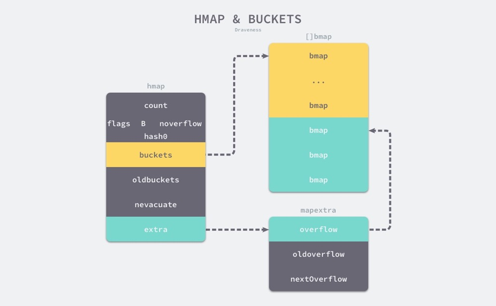
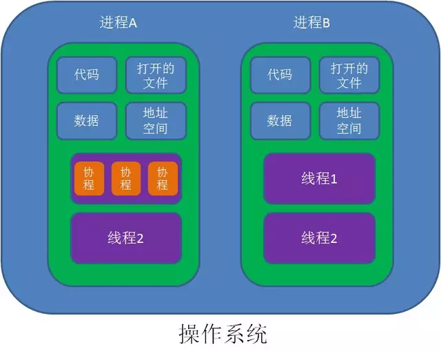
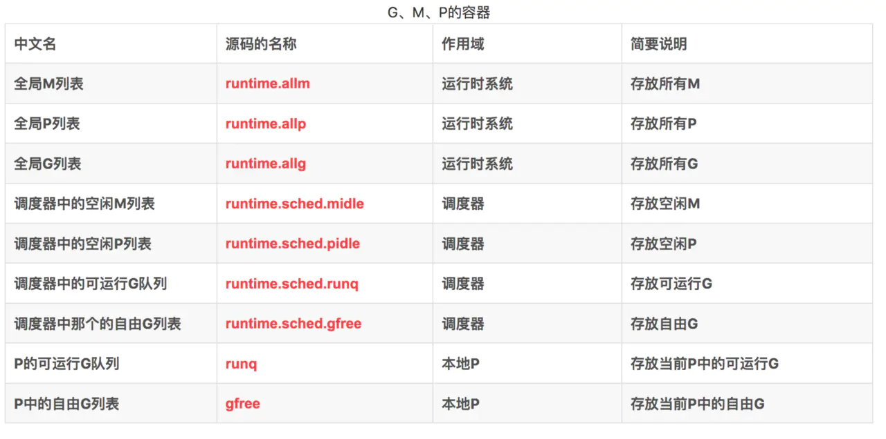

## 知识整理

### Go语言基础

#### 基本数据结构
##### slice
1. 数据结构

   编译期间的切片是 Slice 类型的，但是在运行时切片由如下的 SliceHeader 结构体表示，一个三元组结构。
   其中 Data 字段是指向数组的指针，Len 表示当前切片的长度，而 Cap 表示当前切片的容量，也就是 Data 数组的大小。
    ```
    type SliceHeader struct {
        Data uintptr
        Len  int
        Cap  int
    }
    ```
   Data 作为一个指针指向的数组是一片连续的内存空间，这片内存空间可以用于存储切片中保存的全部元素，
   数组中的元素只是逻辑上的概念，底层存储其实都是连续的，所以我们可以将切片理解成一片连续的内存空间加上长度与容量的标识。
   

2. 追加和扩容

   在分配内存空间之前需要先确定新的切片容量，Go 语言根据切片的当前容量选择不同的策略进行扩容：
   - 如果期望容量大于当前容量的两倍就会使用期望容量；
   - 如果当前切片的长度小于 1024 就会将容量翻倍；
   - 如果当前切片的长度大于 1024 就会每次增加 25% 的容量，直到新容量大于期望容量；

3. 拷贝切片

   当我们使用 copy(a, b) 的形式对切片进行拷贝时，编译期间的 cmd/compile/internal/gc.copyany 函数也会分两种情况进行处理，
   如果当前 copy 不是在运行时调用的，copy(a, b) 会被直接转换成下面的代码：
    ```
    n := len(a)
    if n > len(b) {
        n = len(b)
    }
    if a.ptr != b.ptr {
        memmove(a.ptr, b.ptr, n*sizeof(elem(a))) 
    }
    ```
   其中 memmove 会负责对内存进行拷贝，在其他情况下，编译器会使用 runtime.slicecopy 函数替换运行期间调用的 copy，例如：go copy(a, b)：
    ```
    func slicecopy(to, fm slice, width uintptr) int {
        if fm.len == 0 || to.len == 0 {
            return 0
        }
        n := fm.len
        if to.len < n {
            n = to.len
        }
        if width == 0 {
            return n
        }
        ...
    
        size := uintptr(n) * width
        if size == 1 {
            *(*byte)(to.array) = *(*byte)(fm.array)
        } else {
            memmove(to.array, fm.array, size)
        }
        return n
    }
    ```
   上述函数的实现非常直接，两种不同的拷贝方式一般都会通过 memmove 将整块内存中的内容拷贝到目标的内存区域中.
   
   相比于依次对元素进行拷贝，这种方式能够提供更好的性能，但是需要注意的是，哪怕使用 memmove 对内存成块进行拷贝，
   但是这个操作还是会占用非常多的资源，在大切片上执行拷贝操作时一定要注意性能影响。

4. 小结

   切片的很多功能都是在运行时实现的了，无论是初始化切片，还是对切片进行追加或扩容都需要运行时的支持，
   需要注意的是在遇到大切片扩容或者复制时可能会发生大规模的内存拷贝，一定要在使用时减少这种情况的发生避免对程序的性能造成影响。


[参考](https://draveness.me/golang/docs/part2-foundation/ch03-datastructure/golang-array-and-slice/)

##### map

1. 哈希表原理

   对key进行哈希，得到一个值，以该值为索引，在连续的内存区域内寻址存放value（一般以数组作为底层存储结构）。
   实现哈希表的关键点在于如何选择哈希函数，哈希函数的选择在很大程度上能够决定哈希表的读写性能。
   
   冲突解决：
   ```
   开放寻址法
   开放寻址法是一种在哈希表中解决哈希碰撞的方法，这种方法的核心思想是对数组中的元素依次探测和比较以判断目标键值对是否存在于哈希表中，
   如果我们使用开放寻址法来实现哈希表，那么在支撑哈希表的数据结构就是数组，不
   过因为数组的长度有限，存储 (author, draven) 这个键值对时会从如下哈希位置开始往下遍历，
   当我们向当前哈希表写入新的数据时发生了冲突，就会将键值对写入到下一个不为空的位置。
   ```
   
   ```
   拉链法(链地址法)
   与开放地址法相比，拉链法是哈希表中最常见的实现方法，大多数的编程语言都用拉链法实现哈希表，
   它的实现比较开放地址法稍微复杂一些，但是平均查找的长度也比较短，各个用于存储节点的内存都是动态申请的，可以节省比较多的存储空间。

   实现拉链法一般会使用数组加上链表，不过有一些语言会在拉链法的哈希中引入红黑树以优化性能，
   拉链法会使用链表数组作为哈希底层的数据结构，我们可以将它看成一个可以扩展的『二维数组』
   
   当我们需要将一个键值对 (Key, Value) 写入哈希表时，键值对中的键 Key 都会先经过一个哈希函数，哈希函数返回的哈希会帮助我们选择一个桶，
   和开放地址法一样，选择桶的方式就是直接对哈希返回的结果取模，
   选择了桶之后就可以遍历当前桶中的链表了，在遍历链表的过程中会遇到以下两种情况：
   
   找到键相同的键值对 —— 更新键对应的值；
   没有找到键相同的键值对 —— 在链表的末尾追加新键值对
   ```
   

2. 数据结构
   
   ```
   type hmap struct {
   	count     int
   	flags     uint8
   	B         uint8
   	noverflow uint16
   	hash0     uint32
   
   	buckets    unsafe.Pointer
   	oldbuckets unsafe.Pointer
   	nevacuate  uintptr
   
   	extra *mapextra
   }
   
   // count 表示当前哈希表中的元素数量；
   // B 表示当前哈希表持有的 buckets 数量，但是因为哈希表中桶的数量都 2 的倍数，所以该字段会存储对数，也就是 len(buckets) == 2^B；
   // hash0 是哈希的种子，它能为哈希函数的结果引入随机性，这个值在创建哈希表时确定，并在调用哈希函数时作为参数传入；
   // oldbuckets 是哈希在扩容时用于保存之前 buckets 的字段，它的大小是当前 buckets 的一半；
   
   
   // 桶的结构体 bmap 在 Go 语言源代码中的定义只包含一个简单的 tophash 字段，
   // tophash 存储了键的哈希的高 8 位，通过比较不同键的哈希的高 8 位可以减少访问键值对次数以提高性能
   type bmap struct {
   	tophash [bucketCnt]uint8
   }
   
   
   // 编译后结构体
   // bmap 结构体其实不止包含 tophash 字段，由于哈希表中可能存储不同类型的键值对并且 Go 语言也不支持泛型，
   // 所以键值对占据的内存空间大小只能在编译时进行推导，这些字段在运行时也都是通过计算内存地址的方式直接访问的，
   // 所以它的定义中就没有包含这些字段，但是我们能根据编译期间的 cmd/compile/internal/gc.bmap 函数对它的结构重建
   type bmap struct {
       topbits  [8]uint8
       keys     [8]keytype
       values   [8]valuetype
       pad      uintptr
       overflow uintptr
   }
   
   ```
   
   
3. 读写操作
    

4. 扩容

##### context
##### channel
##### select
##### timer

#### 调度器

1. 进程、线程、协程
   
   进程就是应用程序的启动实例。比如我们运行一个游戏，打开一个软件，就是开启了一个进程。
   进程拥有代码和打开的文件资源、数据资源、独立的内存空间。
   文本区域存储处理器执行的代码，
   数据区域存储变量和进程执行期间使用的动态分配的内存，
   堆栈区域存储着活动过程调用的指令和本地变量。
   进程是抢占式的争夺CPU运行自身,而CPU单核的情况下同一时间只能执行一个进程的代码,但是多进程的实现则是通过CPU飞快的切换不同进程,因此使得看上去就像是多个进程在同时进行。
   通信问题:由于进程间是隔离的,各自拥有自己的内存内存资源, 因此相对于线程比较安全, 所以不同进程之间的数据只能通过 IPC(Inter-Process Communication) 进行通信共享。
   *进程是系统分配资源的最小单位*
   
   线程是操作系统调度时的最基本单元，而 Linux 在调度器并不区分进程和线程的调度，它们在不同操作系统上也有不同的实现，但是在大多数的实现中线程都属于进程。
   线程共享进程的内存地址空间，
   线程拥有自己的栈空间。
   通信问题：共享同样的地址空间，fd等资源，可通过全局变量通信；需注意并发时的线程安全；互斥锁。
   *线程是CPU调度的最小单位*
   
   *无论进程还是线程，都是由操作系统所管理的*
   
   *线程和进程的上下文切换*
   进程切换分3步:
   1. 切换页目录以使用新的地址空间
   2. 切换内核栈
   3. 切换硬件上下文
   
   而线程切换只需要第2、3步,因此进程的切换代价比较大。
   
   协程是属于线程的。协程程序是在线程里面跑的，
   协没有系统级别的上下文切换消耗，协程的调度切换是用户(程序员)手动切换的，需用户自己实现调度器以及协程上下文切换。
   相当于在一个线程持有的cpu时间片内，执行用户的多个计算任务，减少线程的频繁切换，因此更加灵活,因此又叫用户空间线程。
   基于上述特点，协程较适合与弱计算型、强IO型的应用（cpu占用时间短，io等待时间长）；结合select/epoll模型可实现较高的效率。
   
     

2. Go调度模型
   
   G — 表示 Goroutine，它是一个待执行的任务。它在运行时调度器中的地位与线程在操作系统中差不多，但是它占用了更小的内存空间，也降低了上下文切换的开销。
   
   M — 表示操作系统的线程，它由操作系统的调度器调度和管理；
   
   P — 表示处理器，它可以被看做运行在线程上的本地调度器；
   
   

3. 数据结构
    
   G
   Goroutine 在 Go 语言运行时使用私有结构体 runtime.g 表示。这个私有结构体非常复杂，总共包含 40 多个用于表示各种状态的成员变量，
   我们在这里也不会介绍全部字段，而是会挑选其中的一部分进行介绍
   ```
   type g struct {
   	    stack       stack   // 描述了当前 Goroutine 的栈内存范围 [stack.lo, stack.hi)
   	    stackguard0 uintptr // 用于调度器抢占式调度
        preempt       bool // 抢占信号
    	preemptStop   bool // 抢占时将状态修改成 `_Gpreempted`
    	preemptShrink bool // 在同步安全点收缩栈
   
        _panic       *_panic // 最内侧的 panic 结构体
   	    _defer       *_defer // 最内侧的延迟函数结构体
   
        m              *m   // 当前 Goroutine 占用的线程，可能为空
        sched          gobuf    // 存储 Goroutine 的调度相关的数据
        atomicstatus   uint32   // Goroutine 的状态
        goid           int64    // Goroutine 的 ID，该字段对开发者不可见，Go 团队认为引入 ID 会让部分 Goroutine 变得更特殊，从而限制语言的并发能力
   }
   
   type gobuf struct {
        sp   uintptr    // 栈指针（Stack Pointer）
        pc   uintptr    // 程序计数器（Program Counter）
        g    guintptr   // 持有 runtime.gobuf 的 Goroutine
        ret  sys.Uintreg    // 系统调用的返回值
        ...
   }
   ```
   gobuf的内容会在调度器保存或者恢复上下文的时候用到，其中的栈指针和程序计数器会用来存储或者恢复寄存器中的值，改变程序即将执行的代码。
   结构体 runtime.g 的 atomicstatus 字段就存储了当前 Goroutine 的状态。除了几个已经不被使用的以及与 GC 相关的状态之外，Goroutine 可能处于以下 9 个状态
   ```
      _Gidle	刚刚被分配并且还没有被初始化
      _Grunnable	没有执行代码，没有栈的所有权，存储在运行队列中
      _Grunning	可以执行代码，拥有栈的所有权，被赋予了内核线程 M 和处理器 P
      _Gsyscall	正在执行系统调用，拥有栈的所有权，没有执行用户代码，被赋予了内核线程 M 但是不在运行队列上
      _Gwaiting	由于运行时而被阻塞，没有执行用户代码并且不在运行队列上，但是可能存在于 Channel 的等待队列上
      _Gdead	没有被使用，没有执行代码，可能有分配的栈
      _Gcopystack	栈正在被拷贝，没有执行代码，不在运行队列上
      _Gpreempted	由于抢占而被阻塞，没有执行用户代码并且不在运行队列上，等待唤醒
      _Gscan	GC 正在扫描栈空间，没有执行代码，可以与其他状态同时存在
   ```
   
   
   M
   
   Go 语言并发模型中的 M 是操作系统线程。调度器最多可以创建 10000 个线程，但是其中大多数的线程都不会执行用户代码（可能陷入系统调用），
   最多只会有 GOMAXPROCS 个活跃线程能够正常运行。
   
   在默认情况下，运行时会将 GOMAXPROCS 设置成当前机器的核数，我们也可以使用 runtime.GOMAXPROCS 来改变程序中最大的线程数。
   操作系统线程在 Go 语言中会使用私有结构体 runtime.m 来表示，这个结构体中也包含了几十个私有的字段，我们依然对其进行了删减，先来了解几个与 Goroutine 直接相关的字段：
   ```
    type m struct {
        // 其中 g0 是持有调度栈的 Goroutine，curg 是在当前线程上运行的用户 Goroutine，这也是操作系统线程唯一关心的两个 Goroutine
    	g0   *g 
    	curg *g
    	
        p             puintptr
        nextp         puintptr
        oldp          puintptr
    }
   ```

    g0 是一个运行时中比较特殊的 Goroutine，它会深度参与运行时的调度过程，包括 Goroutine 的创建、大内存分配和 CGO 函数的执行。在后面的小节中，
    我们会经常看到 g0 的身影。runtime.m 结构体中还存在着三个处理器字段，它们分别表示正在运行代码的处理器 p、暂存的处理器 nextp 和执行系统调用之前的使用线程的处理器 oldp
  
   P
   
   调度器中的处理器 P 是线程和 Goroutine 的中间层，它能提供线程需要的上下文环境，也会负责调度线程上的等待队列，通过处理器 P 的调度，每一个内核线程都能够执行多个 Goroutine，它能在 Goroutine 进行一些 I/O 操作时及时切换，提高线程的利用率。
   
   因为调度器在启动时就会创建 GOMAXPROCS 个处理器，所以 Go 语言程序的处理器数量一定会等于 GOMAXPROCS，这些处理器会绑定到不同的内核线程上并利用线程的计算资源运行 Goroutine。
   
   runtime.p 是处理器的运行时表示，作为调度器的内部实现，它包含的字段也非常多，其中包括与性能追踪、垃圾回收和计时器相关的字段，这些字段也非常重要，但是在这里就不一一展示了，我们主要关注处理器中的线程和运行队列：
   
   ```
   type p struct {
   	m           muintptr
   
   	runqhead uint32
   	runqtail uint32
   	runq     [256]guintptr
   	runnext guintptr
   	...

    状态	描述
    _Pidle	处理器没有运行用户代码或者调度器，被空闲队列或者改变其状态的结构持有，运行队列为空
    _Prunning	被线程 M 持有，并且正在执行用户代码或者调度器
    _Psyscall	没有执行用户代码，当前线程陷入系统调用
    _Pgcstop	被线程 M 持有，当前处理器由于垃圾回收被停止
    _Pdead	当前处理器已经不被使用
   }
   ```

   调度器sched
   
   调度器，所有 goroutine 被调度的核心，存放了调度器持有的全局资源，访问这些资源需要持有锁：
   管理了能够将 G 和 M 进行绑定的 M 队列
   管理了空闲的 P 链表（队列）
   管理了 G 的全局队列
   管理了可被复用的 G 的全局缓存
   管理了 defer 池
```
type schedt struct {
	lock mutex

	pidle      puintptr	// 空闲 p 链表
	npidle     uint32	// 空闲 p 数量
	nmspinning uint32	// 自旋状态的 M 的数量
	runq       gQueue	// 全局 runnable G 队列
	runqsize   int32
	gFree struct {		// 有效 dead G 的全局缓存.
		lock    mutex
		stack   gList	// 包含栈的 Gs
		noStack gList	// 没有栈的 Gs
		n       int32
	}
	sudoglock  mutex	// sudog 结构的集中缓存
	sudogcache *sudog
	deferlock  mutex	// 不同大小的有效的 defer 结构的池
	deferpool  [5]*_defer
	
	...
}
```
   
   
   MPG容器结构
   
   
   
4. 调度器启动

5. 协程创建与调度

6. 触发调度


#### 系统监控 sysmon

1. 设计原理&启动
    
   Go 语言的系统监控起到了很重要的作用，它在内部启动了一个不会中止的循环，在循环的内部会轮询网络、抢占长期运行或者处于系统调用的 Goroutine 以及触发垃圾回收，
   通过这些行为，它能够让系统的运行状态变得更健康。
   

2. 循环监控

   检查死锁
   
   
   运行计时器
   
   运行网络轮训器 netpoll
   
   抢占处理器
   
   垃圾回收
   
3. 小结
    
   运行时通过系统监控来触发线程的抢占、网络的轮询和垃圾回收，保证 Go 语言运行时的可用性。
   系统监控能够很好地解决尾延迟的问题，减少调度器调度 Goroutine 的饥饿问题并保证计时器在尽可能准确的时间触发。

#### 内存模型

#### 垃圾回收机制

### 延伸阅读
[参考](https://draveness.me/golang/docs)


----
### 常用后端组件

#### mysql

#### redis

#### mq
##### rabbitMq
##### kafka

#### nginx

#### 分布式
##### etcd
##### consul
##### raft
##### zk


### 计算机基础

#### tcp三次握手 四次挥手

#### http/https tls协议

#### http2

#### grpc probuf

### 开发运维

#### linux
##### 服务器各项性能指标
##### 排查问题流程
##### 常用命令

#### docker

#### k8s
 

### 项目经验

#### 通用网关项目
   api网关，负责公司的服务路由、登录鉴权、请求转发等需求。
   
   服务端，处理接受外部请求。集群模式，可水平扩展。
   
   配置管理端，配合平台管理服务元信息、服务api、负载均衡器、限流熔断的配置。

##### 微服务框架
    
- Go Micro
    ```
    服务发现 - 应用程序自动注册到服务发现系统。
    负载平衡 - 客户端负载平衡，用于平衡服务实例之间的请求。
    同步通信 - 提供请求 / 响应传输层。
    异步通信 - 内置发布 / 订阅功能。
    消息编码 - 基于消息的内容类型头的编码 / 解码。
    RPC 客户机 / 服务器包 - 利用上述功能并公开接口来构建微服务
    ```

- Go Kit
  ```
  认证 - Basic 认证和 JWT 认证
  传输 - HTTP、Nats、gRPC 等等。
  日志记录 - 用于结构化服务日志记录的通用接口。
  指标 - CloudWatch、Statsd、Graphite 等。
  追踪 - Zipkin 和 Opentracing。
  服务发现 - Consul、Etcd、Eureka 等等。
  断路器 - Hystrix 的 Go 实现。
  ```
    
##### grpc


##### 服务注册、发现
    借鉴go-micro.register自己实现，支持etcd/consul后端存储可选
    service启动的时候进行注册，关闭时deregister，10秒expire，2/3*expireTime秒主动同步心跳
    http网关启动时拉取并更新保存一份本地缓存，watch监听配置变更
    可配合nginx使用，详情参考nginx-upstream配置

##### 服务限流
    支持不同级别的限流，默认限流策略：gatewayLimit --> ipLimit --> serviceLimit --> apiLimit --> api级别的其他自定义限流器
    限流算法以及实现：
        redis+lua实现的分布式限流器，采用令牌通算法实现
        
    扩展：
        漏桶算法
        将每个请求视作"水滴"放入"漏桶"进行存储；
        “漏桶"以固定速率向外"漏"出请求来执行如果"漏桶"空了则停止"漏水”；
        如果"漏桶"满了则多余的"水滴"会被直接丢弃。
        漏桶算法多使用队列实现，服务的请求会存到队列中，服务的提供方则按照固定的速率从队列中取出请求并执行，过多的请求则放在队列中排队或直接拒绝。
        漏桶算法的缺陷也很明显，当短时间内有大量的突发请求时，即便此时服务器没有任何负载，每个请求也都得在队列中等待一段时间才能被响应。
        
        令牌桶算法
        令牌以固定速率生成；
        生成的令牌放入令牌桶中存放，如果令牌桶满了则多余的令牌会直接丢弃，当请求到达时，会尝试从令牌桶中取令牌，取到了令牌的请求可以执行；
        如果桶空了，那么尝试取令牌的请求会被直接丢弃。
        令牌桶算法既能够将所有的请求平均分布到时间区间内，又能接受服务器能够承受范围内的突发请求，因此是目前使用较为广泛的一种限流算法。
   [参考](https://www.infoq.cn/article/Qg2tX8fyw5Vt-f3HH673)

##### 负载均衡
   可结合服务发现使用，动态负载均衡。
   
   - 随机
     
   - 轮训
   
   - 带权重轮训
     ```
        var total int64
     	l := len(servers)
     	if 0 >= l {
     		return nil
     	}
     
     	best := ""
     	for i := l - 1; i >= 0; i-- {
     		svr := servers[i]
     		weight, err := strconv.ParseInt(svr.Metadata["weight"], 10, 64)
     		if err != nil {
     			return nil
     		}
     		id := svr.Id
     
     		if _, ok := w.opts[id]; !ok {
     			w.opts[id] = &weightRobin{
     				node: svr,
     				effectiveWeight: weight,
     			}
     		}
     
     		wt := w.opts[id]
     		wt.currentWeight += wt.effectiveWeight
     		total += wt.effectiveWeight
     
     		if wt.effectiveWeight < weight {
     			wt.effectiveWeight++
     		}
     
     		if best == "" || w.opts[best] == nil || wt.currentWeight > w.opts[best].currentWeight {
     			best = id
     		}
     	}
     
     	if best == "" {
     		return nil
     	}
     
     	w.opts[best].currentWeight -= total
     ```
   
   - hash 可指定hash字符串 $http_refer $client_ip $uri $uid $phone $email 
       
   
##### 服务降级
   hystrix-go实现的熔断器
   
   其他熔断器实现：
   

##### 服务监控
   使用prometheus实现，各api请求信息统计、延时统计、错误统计、错误msg分类。
   业务服务也可主动上报自身的业务监控指标。
   
   使用promPushGateway的方式进行上报，各服务只需往pushgateway推送指标即可，promServer从pushgateway采集信息，减少业务入侵与网络隔离。
   
   监控平台使用granfa
   
   优化方向，使用metric包装监控信息接口，解耦prometheus的具体实现，比如可使用xxx实现
   

##### 链路追踪
   通过Opentracing包实现，后端存储使用jaeger


#### 消息网关
##### 长连接
##### websocket
##### 消息队列 延时消息
##### 模块解耦
##### 模块解耦

#### 交易所

   初期业务模型：市场报价制，价格不受自身平台用户的交易所影响。用户下价格委托单，价格达成机成交。
   
   初期项目架构：bitcoin-kline(采集外部市场价)、trans-server(用户交易api)
   
   项目核心组件：全局用户信息列表，[ncpu]*reqworker, 根据uid取模处理对应用户请求。
   缺点：存在全局锁、热点数据、导致worker工作不均匀、并发性能低，有状态的内存计算型服务，中心化，无法水平扩展。
   
   
   改进：
   ```
   方案1
   用户unit存储在worker里面，每个worker串行处理用户请求。
   增加集群模式，水平扩展。
   在trans-service之前，加一层proxy，根据uid做hash，保证同一个uid只可能路由到下游某一台服务器，类似hash分片的概念。
   
   难点&缺点：集群可用性，某一台机器故障后，会导致需要全部机器reload，uid重新分片
   
   方案2
   鉴于业务特点，用户成交不影响价格，所以用户之间是可并行的，单用户设计账户操作，不可并行。
   trans-server拆分成两个服务，一个调度服务，一个api-server服务。
   调度服务服务根据uid进行计算任务的分发，每个uid对应一个分布式锁。
   api-server计算处理单用户的数据，
   
   难点&缺点：调度服务需单节点，中心化。
   
   ```
   
   
   后期业务变更：需引入市场撮合机制，原先业务模型基本被推翻，引入别的分支，扩展原有架构。
   
   
##### 应用特性

   撮合机制，需存在两个匹配队列，买方队列、卖方队列。
   
   数据库撮合：数据落地到数据库，每次撮合从数据库取出队列进行匹配。
   内存撮合：数据存于内存，记录日志，同时落地到数据库；撮合时从内存进行匹配。
   
   内存模型效率高，对数据库性能要求低。都存在单点串行问题，由撮合模式决定，同时只能有一个报价在进行撮合。
   
    
##### 业内常用解决方案

   采用内存撮合模型，同时通过分布式部署保证单点的高可用

##### 有状态分布式应用
   zk raft poixs


##### raft协议具体实现


