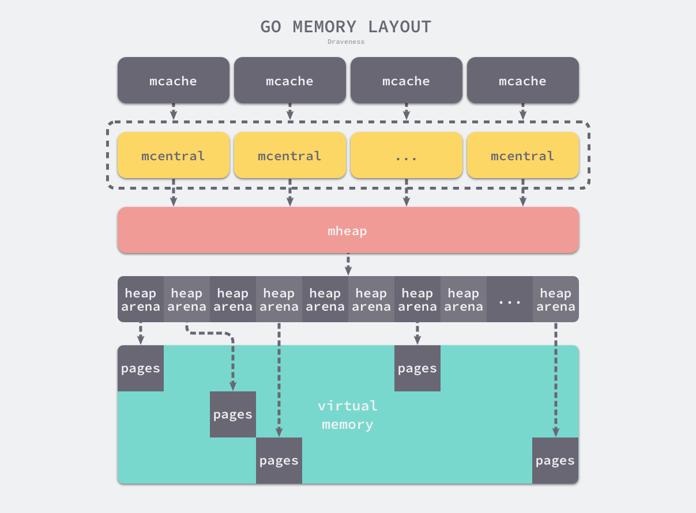
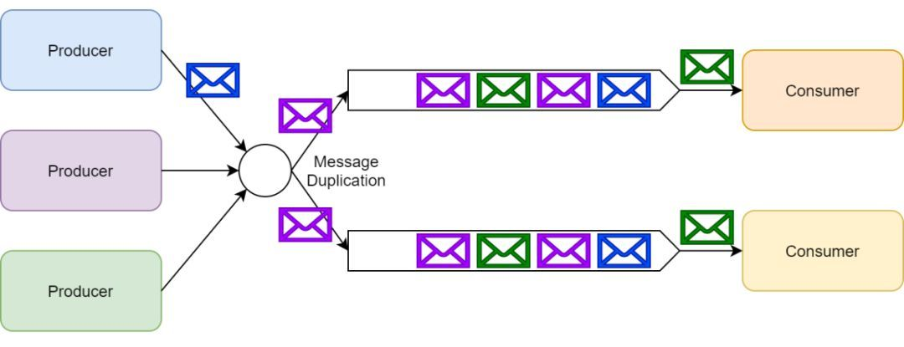
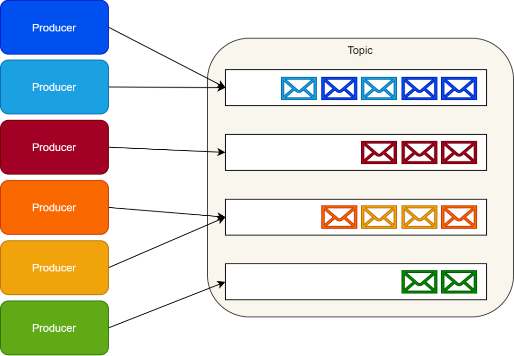
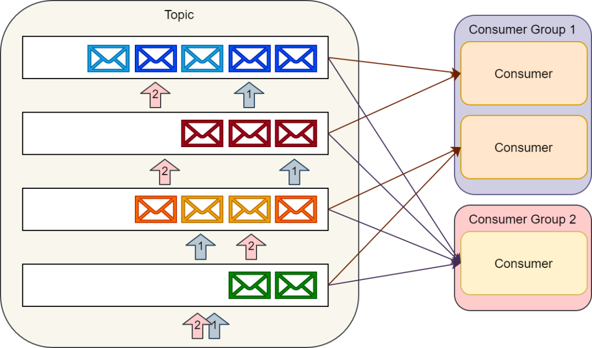
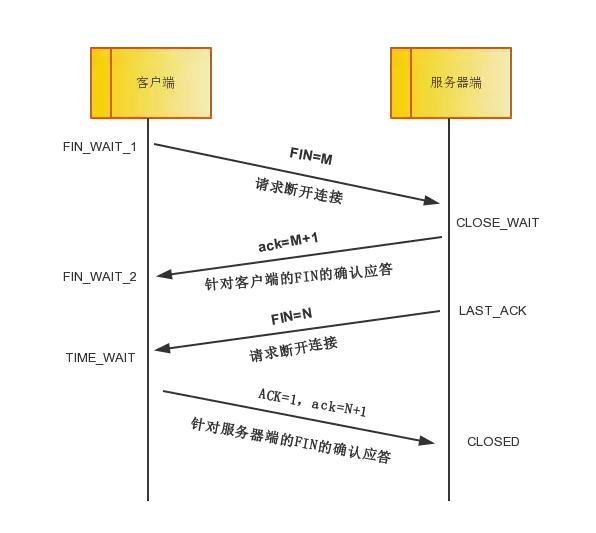
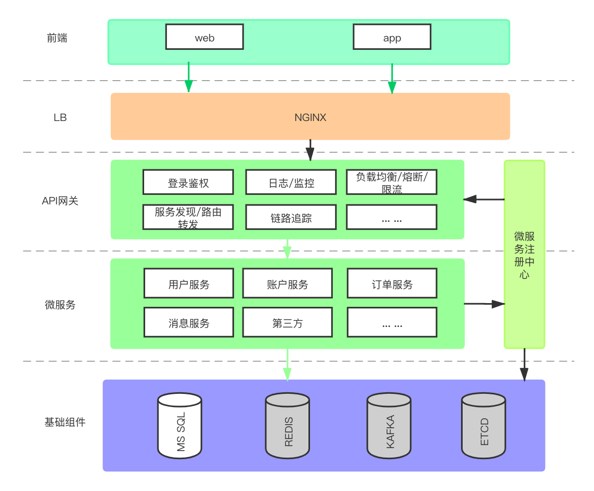
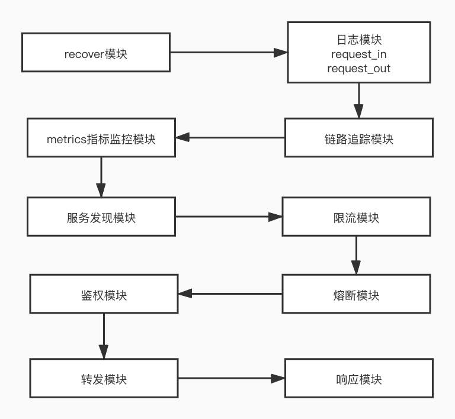
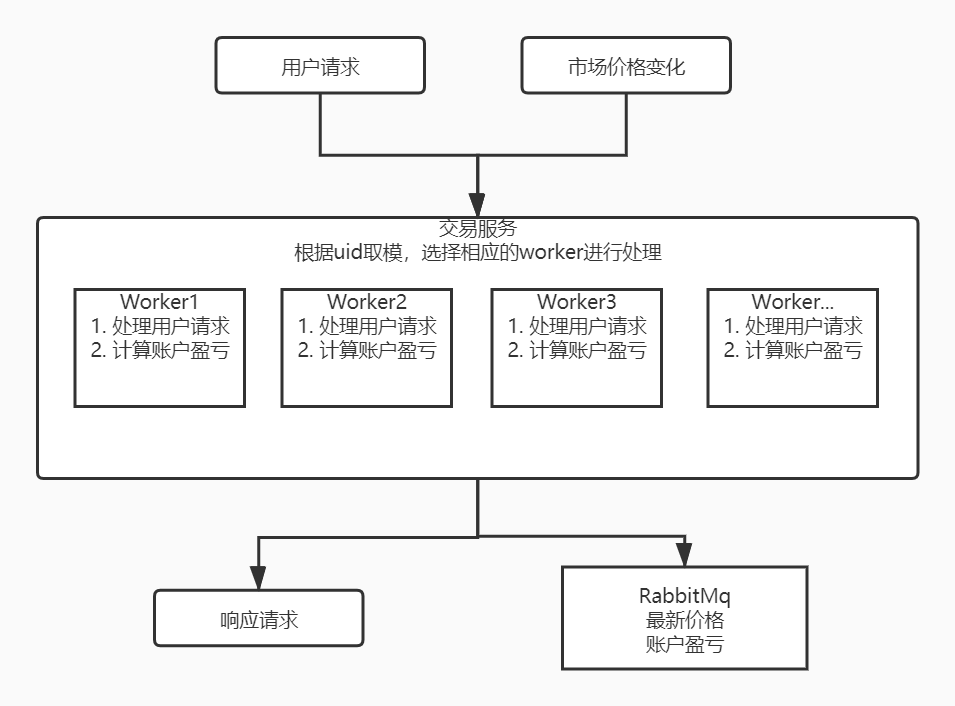

## 知识整理

 * [Go语言基础](#go语言基础)
    * [基本数据结构](#基本数据结构)
       * [slice](#slice)
       * [map](#map)
       * [context](#context)
       * [channel](#channel)
       * [select](#select)
       * [timer](#timer)
    * [调度器](#调度器)
    * [系统监控 sysmon](#系统监控-sysmon)
    * [内存模型](#内存模型)
    * [垃圾回收机制](#垃圾回收机制)
 * [延伸阅读](#延伸阅读)
 * [常用后端组件](#常用后端组件)
    * [mysql](#mysql)
    * [redis](#redis)
    * [mq](#mq)
       * [rabbitMq](#rabbitmq)
       * [kafka](#kafka)
    * [nginx](#nginx)
    * [分布式](#分布式)
       * [etcd](#etcd)
       * [consul](#consul)
       * [raft](#raft)
       * [zk](#zk)
 * [计算机基础](#计算机基础)
    * [tcp三次握手 四次挥手](#tcp三次握手-四次挥手)
    * [http/https tls协议](#httphttps-tls协议)
    * [http2](#http2)
    * [grpc protobuf](#grpc-protobuf)
 * [开发运维](#开发运维)
    * [linux](#linux)
       * [服务器各项性能指标](#服务器各项性能指标)
       * [排查问题流程](#排查问题流程)
       * [常用命令](#常用命令)
    * [docker](#docker)
    * [k8s](#k8s)
 * [项目经验](#项目经验)
    * [通用网关项目](#通用网关项目)
       * [微服务框架](#微服务框架)
       * [服务注册、发现](#服务注册发现)
       * [服务限流](#服务限流)
       * [负载均衡](#负载均衡)
       * [服务降级](#服务降级)
       * [服务监控](#服务监控)
       * [链路追踪](#链路追踪)
    * [消息网关](#消息网关)
       * [长连接](#长连接)
       * [websocket](#websocket)
       * [消息队列 延时消息](#消息队列-延时消息)
       * [模块解耦](#模块解耦)
       * [模块解耦](#模块解耦-1)
    * [交易所](#交易所)
       * [应用特性](#应用特性)
       * [业内常用解决方案](#业内常用解决方案)
       * [有状态分布式应用](#有状态分布式应用)
       * [raft协议具体实现](#raft协议具体实现)

### Go语言基础

#### 基本数据结构

##### 数组
1. 数据结构

   &Array{Elem: elem, Bound: bound}

##### slice
1. 数据结构

   编译期间的切片是 Slice 类型的，但是在运行时切片由如下的 SliceHeader 结构体表示，一个三元组结构。
   其中 Data 字段是指向数组的指针，Len 表示当前切片的长度，而 Cap 表示当前切片的容量，也就是 Data 数组的大小。
    ```
    type SliceHeader struct {
        Data uintptr
        Len  int
        Cap  int
    }
    ```
   Data 作为一个指针指向的数组是一片连续的内存空间，这片内存空间可以用于存储切片中保存的全部元素，
   数组中的元素只是逻辑上的概念，底层存储其实都是连续的，所以我们可以将切片理解成一片连续的内存空间加上长度与容量的标识。
   

2. 追加和扩容

   在分配内存空间之前需要先确定新的切片容量，Go 语言根据切片的当前容量选择不同的策略进行扩容：
   - 如果期望容量大于当前容量的两倍就会使用期望容量；
   - 如果当前切片的长度小于 1024 就会将容量翻倍；
   - 如果当前切片的长度大于 1024 就会每次增加 25% 的容量，直到新容量大于期望容量；

3. 拷贝切片

   当我们使用 copy(a, b) 的形式对切片进行拷贝时，编译期间的 cmd/compile/internal/gc.copyany 函数也会分两种情况进行处理，
   如果当前 copy 不是在运行时调用的，copy(a, b) 会被直接转换成下面的代码：
    ```
    n := len(a)
    if n > len(b) {
        n = len(b)
    }
    if a.ptr != b.ptr {
        memmove(a.ptr, b.ptr, n*sizeof(elem(a))) 
    }
    ```
   其中 memmove 会负责对内存进行拷贝，在其他情况下，编译器会使用 runtime.slicecopy 函数替换运行期间调用的 copy，例如：go copy(a, b)：
    ```
    func slicecopy(to, fm slice, width uintptr) int {
        if fm.len == 0 || to.len == 0 {
            return 0
        }
        n := fm.len
        if to.len < n {
            n = to.len
        }
        if width == 0 {
            return n
        }
        ...
    
        size := uintptr(n) * width
        if size == 1 {
            *(*byte)(to.array) = *(*byte)(fm.array)
        } else {
            memmove(to.array, fm.array, size)
        }
        return n
    }
    ```
   上述函数的实现非常直接，两种不同的拷贝方式一般都会通过 memmove 将整块内存中的内容拷贝到目标的内存区域中.
   
   相比于依次对元素进行拷贝，这种方式能够提供更好的性能，但是需要注意的是，哪怕使用 memmove 对内存成块进行拷贝，
   但是这个操作还是会占用非常多的资源，在大切片上执行拷贝操作时一定要注意性能影响。

4. 小结

   切片的很多功能都是在运行时实现的了，无论是初始化切片，还是对切片进行追加或扩容都需要运行时的支持，
   需要注意的是在遇到大切片扩容或者复制时可能会发生大规模的内存拷贝，一定要在使用时减少这种情况的发生避免对程序的性能造成影响。


[参考](https://draveness.me/golang/docs/part2-foundation/ch03-datastructure/golang-array-and-slice/)

##### map

1. 哈希表原理

   对key进行哈希，得到一个值，以该值为索引，在连续的内存区域内寻址存放value（一般以数组作为底层存储结构）。
   实现哈希表的关键点在于如何选择哈希函数，哈希函数的选择在很大程度上能够决定哈希表的读写性能。
   
   冲突解决：
   ```
   开放寻址法
   开放寻址法是一种在哈希表中解决哈希碰撞的方法，这种方法的核心思想是对数组中的元素依次探测和比较以判断目标键值对是否存在于哈希表中，
   如果我们使用开放寻址法来实现哈希表，那么在支撑哈希表的数据结构就是数组，不
   过因为数组的长度有限，存储 (author, draven) 这个键值对时会从如下哈希位置开始往下遍历，
   当我们向当前哈希表写入新的数据时发生了冲突，就会将键值对写入到下一个不为空的位置。
   ```
   
   ```
   拉链法(链地址法)
   与开放地址法相比，拉链法是哈希表中最常见的实现方法，大多数的编程语言都用拉链法实现哈希表，
   它的实现比较开放地址法稍微复杂一些，但是平均查找的长度也比较短，各个用于存储节点的内存都是动态申请的，可以节省比较多的存储空间。

   实现拉链法一般会使用数组加上链表，不过有一些语言会在拉链法的哈希中引入红黑树以优化性能，
   拉链法会使用链表数组作为哈希底层的数据结构，我们可以将它看成一个可以扩展的『二维数组』
   
   当我们需要将一个键值对 (Key, Value) 写入哈希表时，键值对中的键 Key 都会先经过一个哈希函数，哈希函数返回的哈希会帮助我们选择一个桶，
   和开放地址法一样，选择桶的方式就是直接对哈希返回的结果取模，
   选择了桶之后就可以遍历当前桶中的链表了，在遍历链表的过程中会遇到以下两种情况：
   
   找到键相同的键值对 —— 更新键对应的值；
   没有找到键相同的键值对 —— 在链表的末尾追加新键值对
   ```
   

2. 数据结构
   
   ```
   type hmap struct {
   	count     int
   	flags     uint8
   	B         uint8
   	noverflow uint16
   	hash0     uint32
   
   	buckets    unsafe.Pointer
   	oldbuckets unsafe.Pointer
   	nevacuate  uintptr
   
   	extra *mapextra
   }
   
   // count 表示当前哈希表中的元素数量；
   // B 表示当前哈希表持有的 buckets 数量，但是因为哈希表中桶的数量都 2 的倍数，所以该字段会存储对数，也就是 len(buckets) == 2^B；
   // hash0 是哈希的种子，它能为哈希函数的结果引入随机性，这个值在创建哈希表时确定，并在调用哈希函数时作为参数传入；
   // oldbuckets 是哈希在扩容时用于保存之前 buckets 的字段，它的大小是当前 buckets 的一半；
   
   
   // 桶的结构体 bmap 在 Go 语言源代码中的定义只包含一个简单的 tophash 字段，
   // tophash 存储了键的哈希的高 8 位，通过比较不同键的哈希的高 8 位可以减少访问键值对次数以提高性能
   type bmap struct {
   	tophash [bucketCnt]uint8
   }
   
   
   // 编译后结构体
   // bmap 结构体其实不止包含 tophash 字段，由于哈希表中可能存储不同类型的键值对并且 Go 语言也不支持泛型，
   // 所以键值对占据的内存空间大小只能在编译时进行推导，这些字段在运行时也都是通过计算内存地址的方式直接访问的，
   // 所以它的定义中就没有包含这些字段，但是我们能根据编译期间的 cmd/compile/internal/gc.bmap 函数对它的结构重建
   type bmap struct {
       topbits  [8]uint8
       keys     [8]keytype
       values   [8]valuetype
       pad      uintptr
       overflow uintptr
   }
   
   ```
   
   
3. 读写操作
    

4. 扩容

##### context
##### channel
   Channel 的实现是一个环形队列加上 mutex 锁的实现，一个发送方队列和一个接收方队列。

1. 底层结构
```
// src/runtime/chan.go
type hchan struct {
	qcount   uint           // 队列中的所有数据数
	dataqsiz uint           // 环形队列的大小
	buf      unsafe.Pointer // 指向大小为 dataqsiz 的数组
	elemsize uint16         // 元素大小
	closed   uint32         // 是否关闭
	elemtype *_type         // 元素类型
	sendx    uint           // 发送索引
	recvx    uint           // 接收索引
	recvq    waitq          // recv 等待列表，即（ <-ch ）
	sendq    waitq          // send 等待列表，即（ ch<- ）
	
    // lock protects all fields in hchan, as well as several
    // fields in sudogs blocked on this channel.
    //
    // Do not change another G's status while holding this lock
    // (in particular, do not ready a G), as this can deadlock
    // with stack shrinking.
    lock mutex
}
type waitq struct { // 等待队列 sudog 双向队列
	first *sudog
	last  *sudog
}

// src/runtime/runtime2.go
// sudogs are allocated from a special pool. Use acquireSudog and
// releaseSudog to allocate and free them.
type sudog struct {
	// The following fields are protected by the hchan.lock of the
	// channel this sudog is blocking on. shrinkstack depends on
	// this for sudogs involved in channel ops.

	g *g

	// isSelect indicates g is participating in a select, so
	// g.selectDone must be CAS'd to win the wake-up race.
	isSelect bool
	next     *sudog
	prev     *sudog
	elem     unsafe.Pointer // data element (may point to stack)

	// The following fields are never accessed concurrently.
	// For channels, waitlink is only accessed by g.
	// For semaphores, all fields (including the ones above)
	// are only accessed when holding a semaRoot lock.

	acquiretime int64
	releasetime int64
	ticket      uint32
	parent      *sudog // semaRoot binary tree
	waitlink    *sudog // g.waiting list or semaRoot
	waittail    *sudog // semaRoot
	c           *hchan // channel
}
```
   buf是缓存数据缓冲的环形队列，recvq sendq分别表示等待的读取和发送队列，对应的有recvx sendx表示各自的索引。
   
   lock用来保护当前hchan的所有fields，同时在持有锁的时候禁止改变其他g的状态，特别是ready其他g，这可能导致其他g被调度，然后发生栈收缩，导致死锁。
   ```
   发送数据过程中， 对要发送数据的指针进行读取，将会与调度器对执行栈的伸缩发生竞争。
   这是因为直接读取 Channel 的数据分为两个过程：1. 读取发送方的值的指针 2. 拷贝到要接收的位置。 
   然而在 1 和 2 这两个步骤之间，发送方的执行栈可能发生收缩，进而指针失效，成为竞争的源头。
   ```
   
   sudog保存着当前的g，以及要发送或者接收的数据。数据可能是指向栈空间的指针。
   
   makechan 实现的本质是根据需要创建的元素大小，对 mallocgc 进行封装，因此，Channel 总是在堆上进行分配，它们会被垃圾回收器进行回收， 
   这也是为什么 Channel 不一定总是需要调用 close(ch) 进行显式地关闭。
   
2. 发送数据
   如果一个 Channel 为零值（比如没有初始化），这时候的发送操作会暂止当前的Goroutine（gopark）。而 gopark会将当前的 Goroutine 休眠，从而发生死锁崩溃。
```
func chansend(c *hchan, ep unsafe.Pointer, block bool) bool {
	// 当向 nil channel 发送数据时，会调用 gopark
	// 而 gopark 会将当前的 Goroutine 休眠，从而发生死锁崩溃
	if c == nil {
		if !block {
			return false
		}
		gopark(nil, nil, waitReasonChanSendNilChan)
		throw("unreachable")
	}

	...
}
```

   发送过程包含三个步骤：
```
1. 持有锁
2. 入队，拷贝要发送的数据
3. 释放锁

其中第二个步骤包含三个子步骤：
1. 找到是否有正在阻塞的接收方，是则直接发送
2. 找到是否有空余的缓存，是则存入
3. 阻塞直到被唤醒
```

3. 接收数据
   接收过程与发送过程类似
```
1. 上锁
2. 从缓存中出队，拷贝要接收的数据
3. 解锁

其中第二个步骤包含三个子步骤：
1. 如果 Channel 已被关闭，且 Channel 没有数据，立刻返回
2. 如果存在正在阻塞的发送方，说明缓存已满，从缓存队头取一个数据，再复始一个阻塞的发送方
3. 否则，检查缓存，如果缓存中仍有数据，则从缓存中读取，读取过程会将队列中的数据拷贝一份到接收方的执行栈中
4. 没有能接受的数据，阻塞当前的接收方 Goroutine
```
   无缓冲 Channel而言v <- ch happens before ch <- v了, 因为无缓冲Channel的接收方会先从发送方栈拷贝数据后，发送方才会被放回调度队列中，等待重新调度。

4. channel关闭
   当 Channel 关闭时，我们必须让所有阻塞的接收方重新被调度，让所有的发送方也重新被调度，
   这时候 的实现先将 Goroutine 统一添加到一个列表中（需要锁），然后逐个地进行复始（不需要锁）。

##### select

##### defer

##### panic

##### interface

##### timer

#### 调度器

1. 进程、线程、协程
   
   进程就是应用程序的启动实例。比如我们运行一个游戏，打开一个软件，就是开启了一个进程。
   进程拥有代码和打开的文件资源、数据资源、独立的内存空间。
   文本区域存储处理器执行的代码，
   数据区域存储变量和进程执行期间使用的动态分配的内存，
   堆栈区域存储着活动过程调用的指令和本地变量。
   进程是抢占式的争夺CPU运行自身,而CPU单核的情况下同一时间只能执行一个进程的代码,但是多进程的实现则是通过CPU飞快的切换不同进程,因此使得看上去就像是多个进程在同时进行。
   通信问题:由于进程间是隔离的,各自拥有自己的内存内存资源, 因此相对于线程比较安全, 所以不同进程之间的数据只能通过 IPC(Inter-Process Communication) 进行通信共享。
   *进程是系统分配资源的最小单位*
   
   线程是操作系统调度时的最基本单元，而 Linux 在调度器并不区分进程和线程的调度，它们在不同操作系统上也有不同的实现，但是在大多数的实现中线程都属于进程。
   线程共享进程的内存地址空间，
   线程拥有自己的栈空间。
   通信问题：共享同样的地址空间，fd等资源，可通过全局变量通信；需注意并发时的线程安全；互斥锁。
   *线程是CPU调度的最小单位*
   
   *无论进程还是线程，都是由操作系统所管理的*
   
   *线程和进程的上下文切换*
   进程切换分3步:
   1. 切换页目录以使用新的地址空间
   2. 切换内核栈
   3. 切换硬件上下文
   
   而线程切换只需要第2、3步,因此进程的切换代价比较大。
   
   协程是属于线程的。协程程序是在线程里面跑的，
   协没有系统级别的上下文切换消耗，协程的调度切换是用户(程序员)手动切换的，需用户自己实现调度器以及协程上下文切换。
   相当于在一个线程持有的cpu时间片内，执行用户的多个计算任务，减少线程的频繁切换，因此更加灵活,因此又叫用户空间线程。
   基于上述特点，协程较适合与弱计算型、强IO型的应用（cpu占用时间短，io等待时间长）；结合select/epoll模型可实现较高的效率。
   
     

2. Go调度模型
   
   G — 表示 Goroutine，它是一个待执行的任务。它在运行时调度器中的地位与线程在操作系统中差不多，但是它占用了更小的内存空间，也降低了上下文切换的开销。
   
   M — 表示操作系统的线程，它由操作系统的调度器调度和管理；本地缓存 mcache
   
   P — 表示处理器，它可以被看做运行在线程上的本地调度器；它存在的意义在于实现工作窃取（work stealing）算法，分散锁压力
   
   

3. 数据结构
    
   G
   Goroutine 在 Go 语言运行时使用私有结构体 runtime.g 表示。这个私有结构体非常复杂，总共包含 40 多个用于表示各种状态的成员变量，
   我们在这里也不会介绍全部字段，而是会挑选其中的一部分进行介绍
   ```
   type g struct {
   	    stack       stack   // 描述了当前 Goroutine 的栈内存范围 [stack.lo, stack.hi)
   	    stackguard0 uintptr // 用于调度器抢占式调度
        preempt       bool // 抢占信号
    	preemptStop   bool // 抢占时将状态修改成 `_Gpreempted`
    	preemptShrink bool // 在同步安全点收缩栈
   
        _panic       *_panic // 最内侧的 panic 结构体
   	    _defer       *_defer // 最内侧的延迟函数结构体
   
        m              *m   // 当前 Goroutine 占用的线程，可能为空
        sched          gobuf    // 存储 Goroutine 的调度相关的数据
        atomicstatus   uint32   // Goroutine 的状态
        goid           int64    // Goroutine 的 ID，该字段对开发者不可见，Go 团队认为引入 ID 会让部分 Goroutine 变得更特殊，从而限制语言的并发能力
   }
   
   type gobuf struct {
        sp   uintptr    // 栈指针（Stack Pointer）
        pc   uintptr    // 程序计数器（Program Counter）
        g    guintptr   // 持有 runtime.gobuf 的 Goroutine
        ret  sys.Uintreg    // 系统调用的返回值
        ...
   }
   ```
   gobuf的内容会在调度器保存或者恢复上下文的时候用到，其中的栈指针和程序计数器会用来存储或者恢复寄存器中的值，改变程序即将执行的代码。
   结构体 runtime.g 的 atomicstatus 字段就存储了当前 Goroutine 的状态。除了几个已经不被使用的以及与 GC 相关的状态之外，Goroutine 可能处于以下 9 个状态
   ```
      _Gidle	刚刚被分配并且还没有被初始化
      _Grunnable	没有执行代码，没有栈的所有权，存储在运行队列中
      _Grunning	可以执行代码，拥有栈的所有权，被赋予了内核线程 M 和处理器 P
      _Gsyscall	正在执行系统调用，拥有栈的所有权，没有执行用户代码，被赋予了内核线程 M 但是不在运行队列上
      _Gwaiting	由于运行时而被阻塞，没有执行用户代码并且不在运行队列上，但是可能存在于 Channel 的等待队列上
      _Gdead	没有被使用，没有执行代码，可能有分配的栈
      _Gcopystack	栈正在被拷贝，没有执行代码，不在运行队列上
      _Gpreempted	由于抢占而被阻塞，没有执行用户代码并且不在运行队列上，等待唤醒
      _Gscan	GC 正在扫描栈空间，没有执行代码，可以与其他状态同时存在
   ```
   
   
   M
   
   Go 语言并发模型中的 M 是操作系统线程。调度器最多可以创建 10000 个线程，但是其中大多数的线程都不会执行用户代码（可能陷入系统调用），
   最多只会有 GOMAXPROCS 个活跃线程能够正常运行。
   
   在默认情况下，运行时会将 GOMAXPROCS 设置成当前机器的核数，我们也可以使用 runtime.GOMAXPROCS 来改变程序中最大的线程数。
   操作系统线程在 Go 语言中会使用私有结构体 runtime.m 来表示，这个结构体中也包含了几十个私有的字段，我们依然对其进行了删减，先来了解几个与 Goroutine 直接相关的字段：
   ```
    type m struct {
        // 其中 g0 是持有调度栈的 Goroutine，curg 是在当前线程上运行的用户 Goroutine，这也是操作系统线程唯一关心的两个 Goroutine
    	g0   *g 
    	curg *g
    	
        p             puintptr
        nextp         puintptr
        oldp          puintptr
    }
   ```

    g0 是一个运行时中比较特殊的 Goroutine，它会深度参与运行时的调度过程，包括 Goroutine 的创建、大内存分配和 CGO 函数的执行。在后面的小节中，
    我们会经常看到 g0 的身影。runtime.m 结构体中还存在着三个处理器字段，它们分别表示正在运行代码的处理器 p、暂存的处理器 nextp 和执行系统调用之前的使用线程的处理器 oldp
  
   P
   
   调度器中的处理器 P 是线程和 Goroutine 的中间层，它能提供线程需要的上下文环境，也会负责调度线程上的等待队列，通过处理器 P 的调度，每一个内核线程都能够执行多个 Goroutine，它能在 Goroutine 进行一些 I/O 操作时及时切换，提高线程的利用率。
   
   因为调度器在启动时就会创建 GOMAXPROCS 个处理器，所以 Go 语言程序的处理器数量一定会等于 GOMAXPROCS，这些处理器会绑定到不同的内核线程上并利用线程的计算资源运行 Goroutine。
   
   runtime.p 是处理器的运行时表示，作为调度器的内部实现，它包含的字段也非常多，其中包括与性能追踪、垃圾回收和计时器相关的字段，这些字段也非常重要，但是在这里就不一一展示了，我们主要关注处理器中的线程和运行队列：
   
   ```
   type p struct {
   	m           muintptr
   
   	runqhead uint32
   	runqtail uint32
   	runq     [256]guintptr
   	runnext guintptr
   	...

    状态	描述
    _Pidle	处理器没有运行用户代码或者调度器，被空闲队列或者改变其状态的结构持有，运行队列为空
    _Prunning	被线程 M 持有，并且正在执行用户代码或者调度器
    _Psyscall	没有执行用户代码，当前线程陷入系统调用
    _Pgcstop	被线程 M 持有，当前处理器由于垃圾回收被停止
    _Pdead	当前处理器已经不被使用
   }
   ```

   调度器sched
   
   调度器，所有 goroutine 被调度的核心，存放了调度器持有的全局资源，访问这些资源需要持有锁：
   管理了能够将 G 和 M 进行绑定的 M 队列
   管理了空闲的 P 链表（队列）
   管理了 G 的全局队列
   管理了可被复用的 G 的全局缓存
   管理了 defer 池
```
type schedt struct {
	lock mutex

	pidle      puintptr	// 空闲 p 链表
	npidle     uint32	// 空闲 p 数量
	nmspinning uint32	// 自旋状态的 M 的数量
	runq       gQueue	// 全局 runnable G 队列
	runqsize   int32
	gFree struct {		// 有效 dead G 的全局缓存.
		lock    mutex
		stack   gList	// 包含栈的 Gs
		noStack gList	// 没有栈的 Gs
		n       int32
	}
	sudoglock  mutex	// sudog 结构的集中缓存
	sudogcache *sudog
	deferlock  mutex	// 不同大小的有效的 defer 结构的池
	deferpool  [5]*_defer
	
	...
}
```
   
   
   MPG容器结构
   
   
   
4. 调度器启动

5. 协程创建与调度

6. 触发调度


#### 系统监控 sysmon

1. 设计原理&启动
    
   Go 语言的系统监控起到了很重要的作用，它在内部启动了一个不会中止的循环，在循环的内部会轮询网络、抢占长期运行或者处于系统调用的 Goroutine 以及触发垃圾回收，
   通过这些行为，它能够让系统的运行状态变得更健康。
   

2. 循环监控

   检查死锁
   
   
   运行计时器
   
   运行网络轮训器 netpoll
   
   抢占处理器
   
   垃圾回收
   
3. 小结
    
   运行时通过系统监控来触发线程的抢占、网络的轮询和垃圾回收，保证 Go 语言运行时的可用性。
   系统监控能够很好地解决尾延迟的问题，减少调度器调度 Goroutine 的饥饿问题并保证计时器在尽可能准确的时间触发。

#### 内存模型

   主要结构
   Go 的内存分配器主要包含以下几个核心组件：
   
   heapArena: 保留整个虚拟地址空间，对应与操作系统上的实际物理内存
   
   mheap：分配的堆，在页大小为 8KB 的粒度上进行管理
   
   mspan：是 mheap 上管理的一连串的页
   
   mcentral：收集了给定大小等级的所有 span
   
   mcache：为 per-P 的缓存
   
   
   
   mcache --> mcentral --> mheap
   
   ```
   // 说明
   heapArena堆区管理结构体
   mheap是最终管理内存分配落地的结构体，通过allspans []*mspan管理所有的mspan，每个mspan有一个uint8类型的字段spanclass标记大小等级与noscan，末位用于标记是否指针。
   内存管理中唯一的全局结构，维护全局的中心缓存列表 central，另一个是管理堆区内存区域arenas。

   所有mspan的分配最终落地到mheap.alloc方法，该方法会返回一个新的*mspan指针。
   mspan有也分配器进行管理，也分配器中的mspan在向系统申请内存时会新增sysAlloc
   
   runtime.mheap.sysAlloc 方法在最后会初始化一个新的 runtime.heapArena 结构体来管理刚刚申请的内存空间，该结构体会被加入页堆的二维矩阵中。
   
   
   mcentral特定大小等级的中心分配器，共有67*2个，在mheap中以central字段进行维护
    central       [numSpanClasses]struct {
    		mcentral mcentral
    		pad      [cpu.CacheLinePadSize - unsafe.Sizeof(mcentral{})%cpu.CacheLinePadSize]byte
    	}
    
   mcache通过alloc数组维护线程所需的内存分配，[numSpanClasses]*mspan 共 67*2=134个
   
   mcache特定大小的内存不足时向，通过加锁获取指定spanclass类型的mcentral对象，通过mcentral对象获取mspan, 并替换当前mspan, 替换前提：当前mspan无空闲内存，且新mspan有空闲内存。
   
   ```
   
   [结构体参考](https://changkun.de/golang/zh-cn/part2runtime/ch07alloc/basic/#heading)
   
   微对象 (0, 16B) — 先使用微型分配器，再依次尝试线程缓存、中心缓存和堆分配内存；
   
   小对象 [16B, 32KB] — 依次尝试使用线程缓存、中心缓存和堆分配内存；
   
   大对象 (32KB, +∞) — 直接在堆上分配内存；
   


[参考](https://draveness.me/golang/docs/part3-runtime/ch07-memory/golang-memory-allocator/)

#### 垃圾回收机制

1. 垃圾回收统一理论
   所有的 GC 算法其存在形式可以归结为追踪（Tracing）和引用计数（Reference Counting）这两种形式的混合运用。
   
   追踪式 GC：从根对象出发，根据对象之间的引用信息，一步步推进直到扫描完毕整个堆并确定需要保留的对象，从而回收所有可回收的对象。
   
   引用计数式 GC：每个对象自身包含一个被引用的计数器，当计数器归零时自动得到回收。因为此方法缺陷较多，在追求高性能时通常不被应用。
   
   追踪式，分为多种不同类型，例如：
   
       标记清扫：从根对象出发，将确定存活的对象进行标记，并清扫可以回收的对象。
       
       标记整理：为了解决内存碎片问题而提出，在标记过程中，将对象尽可能整理到一块连续的内存上。
       
       增量式：将标记与清扫的过程分批执行，每次执行很小的部分，从而增量的推进垃圾回收，达到近似实时、几乎无停顿的目的。
       
       增量整理：在增量式的基础上，增加对对象的整理过程。
       
       分代式：将对象根据存活时间的长短进行分类，存活时间小于某个值的为年轻代，存活时间大于某个值的为老年代，永远不会参与回收的对象为永久代。并根据分代假设（如果一个对象存活时间不长则倾向于被回收，如果一个对象已经存活很长时间则倾向于存活更长时间）对对象进行回收。
       
   引用计数：根据对象自身的引用计数来回收，当引用计数归零时立即回收。
   
2. Go垃圾回收算法
   
   标记清扫法+混合写屏障。混合写屏障的引入是为了减少STW的时间，使赋值器、垃圾收集器可并行执行。
   
   三色标记法
   
       从垃圾回收器的视角来看，三色抽象规定了三种不同类型的对象，并用不同的颜色相称：
       白色对象（可能死亡）：未被回收器访问到的对象。在回收开始阶段，所有对象均为白色，当回收结束后，白色对象均不可达。
       灰色对象（波面）：已被回收器访问到的对象，但回收器需要对其中的一个或多个指针进行扫描，因为他们可能还指向白色对象。
       黑色对象（确定存活）：已被回收器访问到的对象，其中所有字段都已被扫描，黑色对象中任何一个指针都不可能直接指向白色对象。
        
   弱三色不变性
        
        垃圾回收器的正确性体现在：不应出现对象的丢失，也不应错误的回收还不需要回收的对象。 作为内存屏障的一种，写屏障（Write Barrier）是一个在并发垃圾回收器中才会出现的概念。
        当以下两个条件同时满足时会破坏垃圾回收器的正确性。
        条件 1: 赋值器修改对象图，导致某一黑色对象引用白色对象；
        条件 2: 从灰色对象出发，到达白色对象的、未经访问过的路径被赋值器破坏。
        
        只要能够避免其中任何一个条件，则不会出现对象丢失的情况，因为：
        如果条件 1 被避免，则所有白色对象均被灰色对象引用，没有白色对象会被遗漏；
        如果条件 2 被避免，即便白色对象的指针被写入到黑色对象中，但从灰色对象出发，总存在一条没有访问过的路径，从而找到到达白色对象的路径，白色对象最终不会被遗漏。
        
        黑色赋值器：已经由回收器扫描过，不会再次对其进行扫描。
        灰色赋值器：尚未被回收器扫描过，或尽管已经扫描过但仍需要重新扫描。
        
        弱三色不变性保证：
        黑色赋值器已经被回收器扫描过， 不会再对其进行任何扫描，一旦其分配新的白色对象 则意味着会导致错误的回收；新分配的对象为黑色。
        
   Go混合屏障技术
        
        灰色赋值器的 Dijkstra 插入屏障
        如果某一对象的引用被插入到已经被标记为黑色的对象中，这类屏障会保守地将其作为非白色存活对象， 以满足强三色不变性。
        写屏障会将被覆盖的指针和新指针都标记成灰色，而所有新创建的对象都会被直接标记成黑色。
        对于插入到黑色对象中的白色指针，无论其在未来是否会被赋值器删除，该屏障都会将其标记为可达（着色）。
        由于 Dijkstra 插入屏障的保守，在一次回收过程中可能会产生一部分被染黑的垃圾对象，只有在下一个回收过程中才会被回收。
        
        黑色赋值器的 Yuasa 删除屏障
        其思想是当赋值器从灰色或白色对象中删除白色指针时，通过写屏障将这一行为通知给并发执行的回收器。 这一过程很像是在操纵对象图之前对图进行了一次快照。
        果一个指针位于波面之前，则删除屏障会保守地将目标对象标记为非白色存活对象，进而避免条件 2 来满足弱三色不变性。
        具体来说，Yuasa 删除屏障 [Yuasa, 1990] 对于在回收过程中，对于被赋值器删除最后一个指向这个对象导致该对象不可达的情况， 仍将其对象进行着色。
[参考](https://changkun.de/golang/zh-cn/part1basic/ch04memory/barrier/)

3. 实现原理
    
    触发时机：
        
        runtime.sysmon runtime.forcegchelper 后台定时检查收集。
        运行时会在应用程序启动时在后台开启一个用于强制触发垃圾收集的 Goroutine，该 Goroutine 的职责非常简单 — 调用 runtime.gcStart 方法尝试启动新一轮的垃圾收集。
        该 Goroutine 会在循环中调用 runtime.goparkunlock 主动陷入休眠等待其他 Goroutine 的唤醒，
        runtime.forcegchelper 在大多数时间都是陷入休眠的，但是它会被系统监控器 runtime.sysmon 在满足垃圾收集条件时唤醒。
        系统监控在每个循环中都会主动构建一个 runtime.gcTrigger 并检查垃圾收集的触发条件是否满足，
        如果满足条件，系统监控会将 runtime.forcegc 状态中持有的 Goroutine 加入全局队列等待调度器的调度。
        
        runtime.GC 用户手动触发， 
        用户程序会通过 runtime.GC 函数在程序运行期间主动通知运行时执行，该方法在调用时会阻塞调用方知道当前垃圾收集循环完成，在垃圾收集期间也可能会通过 STW 暂停整个程序。
        
        runtime.mallocgc 申请内存时根据堆大小触发垃圾收集。
    
    垃圾收集启动
        
        垃圾收集在启动过程一定会调用 runtime.gcStart 函数，虽然该函数的实现比较复杂，
        但是它的主要职责就是修改全局的垃圾收集状态到 _GCmark 并做一些准备工作，我们会分以下几个阶段介绍该函数的实现：
        两次调用 runtime.gcTrigger.test 方法检查是否满足垃圾收集条件；
        暂停程序、在后台启动用于处理标记任务的工作 Goroutine、确定所有内存管理单元都被清理以及其他标记阶段开始前的准备工作；此时会STW
        进入标记阶段、准备后台的标记工作、根对象的标记工作以及微对象、恢复用户程序，进入并发扫描和标记阶段；
    

### 延伸阅读
[参考](https://draveness.me/golang/docs)
[参考](https://changkun.de/golang/zh-cn/part2runtime/ch07alloc/basic/#heading)


----
### 常用后端组件

#### mysql

1. myisam innodb的区别

    
    InnoDB支持事物，而MyISAM不支持事物
    InnoDB支持行级锁，而MyISAM支持表级锁
    InnoDB支持MVCC, 而MyISAM不支持
    InnoDB支持外键，而MyISAM不支持
    InnoDB不支持全文索引，而MyISAM支持
    索引结构不一样，myisam表可以不存在主键索引
    
    
   索引
   
    MyISAM的索引方式索引和数据存放是分开的，非聚集”的，所以也叫做非聚集索引。
    MyISAM中索引检索的算法为首先按照B+Tree搜索算法搜索索引，如果指定的Key存在，则取出其data域的值，
    data域里存放的是数据的行号，MyISAM会按照数据插入的顺序分配行号，从0开始，然后按照数据插入的顺序存储在磁盘上。
    如果行是定长的，可以从表的开头跳过相应的字节找到需要的行，变长有其他策略。然后以data域的值计算出地址，读取相应数据记录。
    
    innodb的索引分为一级索引和二级索引，一级索引即主键索引，使用的是聚簇索引(索引与数据存放在一起)，二级索引非聚簇,底层数据结构都是b+tree.
    聚簇索引的每一个叶子节点都包含了主键值、事务ID、用于事务和MVCC的回滚指针以及所有的剩余列，即所有数据。
    二级索引的叶子节点存放的是主键的值，这种策略的缺点是二级索引需要两次索引查找，第一次在二级索引中查找主键，第二次在聚簇索引中通过主键查找需要的数据行。
    
    聚簇索引的优点
    可以把相关数据存储在一起，减少数据查询时的磁盘I/O
    数据访问更快，因为聚簇索引就是表，索引和数据保存在一个B+Tree中
    使用索引覆盖的查询时可以直接使用页节点中的主键值
    
    缺点
    插入慢，严重依赖插入顺序。主键建议用自增ID，保证插入顺序行。

[参考](https://juejin.im/post/6844903701480472590)
    
    
2. 事务隔离级别

    
    读未提交(RU)
    读已提交(RC)
    可重复读(RR)
    串行
    
    innodb默认可重复读
    

3. 事务的实现原理

    
    

4. redo undo binlog的作用以及区别

    
    redolog
    用于重做保证数据完整性，防止内存中的数据未及时刷新到磁盘
    
    undolog
    用于数据回滚，对未提交的数据进行回滚操作
    
    binlog
    binlog是server层实现的,追加的方式写入的。记录数据变更的操作，有stament row 以及 mutil三中模式
    
    每当修改数据的时候，会记录redolog，同时记录一条相反的undo，此时记录状态是prepared，在记录binlog。
    commit的时候状态变成commit.

5. 性能调优

    
    explain出来的各种item的意义
    
    select_type：表示查询中每个select子句的类型
    type：表示MySQL在表中找到所需行的方式，又称“访问类型”
    possible_keys：查询涉及到的字段上若存在索引，则该索引将被列出，但不一定被查询使用
    key：实际使用的索引，若没有使用索引，显示为NULL
    key_len：索引中使用的字节数
    ref：表示上述表的连接匹配条件，即哪些列或常量被用于查找索引列上的值
    Extra：包含不适合在其他列中显示但十分重要的额外信息
    
    profile的意义以及使用场景
    查询到 SQL 会执行多少时间, 并看出 CPU/Memory 使用量, 执行过程中 Systemlock, Table lock 花多少时间等等
    
    慢查询分析工具mysqldumpslow
    
    -s 表示按照何种方式排序
        c 访问次数
        l 锁定时间
        r 返回记录
        t 查询时间
        al 平均锁定时间
        ar 平均返回记录数
        at  平均查询时间
    -t 返回前面多少条数据
    -g 后边搭配一个正则匹配模式，大小写不敏感
    
    mysqldumpslow -s r -t 10 /var/lib/mysql/695f5026f0f6-slow.log
    mysqldumpslow -s t -t 10 /var/lib/mysql/695f5026f0f6-slow.log

6. innodb行锁 乐观锁和悲观锁

    乐观锁
    
    假定数据在读取期间不会被其他进程修改，每次提交时检查。innodb没有相应实现。
    实现方式：给表增加version or timestamp 列，每次提交时加上where id=xxx and version=xxx
    update col=xxx, version=version+1 where id=xxx and version=xxx
    
    悲观锁
    
    假定数据在读取期间会被其他进程修改，所以在操作之前提前加锁，使得只有自身或指定类型的进程才能操作当前数据。
    分为共享锁、排它锁，innodb引擎有相应实现。
    
    共享锁
    
    又称读锁，用户可以并发的读。会阻塞排它锁，数据使用共享锁后，update、insert、delete语句执行时会自动加排它锁进行阻塞等待。
    实现方式：select * from t where id=1 lock in share mode
    
    排他锁
    
    写锁，会阻塞其他的读锁与写锁。
    实现方式：select * from t where id=1 for update
    
    行锁/表锁
    
    指数据被锁定的方式，写锁、读锁都涉及。当查询所需要的数据不存在索引，或未能使用到索引，则会变成表锁。
    
    死锁排查
    
    查询是否锁表：show open tables where IN_use>0;
    查询进程：show processlist;
    查看事务：select * from INFORMATION_SCHEMA.INNODB_TRX;
    查看当前锁定的事务：select * from INFORMATION_SCHEMA.INNODB_LOCKS;
    查看当前等锁的事务：select * from INFORMATION_SCHEMA.INNODB_LOCK_WAITS;
    

[参考](https://segmentfault.com/a/1190000015815061)

7. drop、delete与truncate的区别
    
    
    1、delete和truncate只删除表的数据不删除表的结构
    
    
    2、速度,一般来说: drop> truncate >delete
    
    
    3、delete语句是dml,这个操作会放到rollback segement中,事务提交之后才生效;
    
    
    4、如果有相应的trigger,执行的时候将被触发. truncate,drop是ddl, 操作立即生效,原数据不放到rollback segment中,不能回滚. 操作不触发trigger.
    
    ps:
    1、不再需要一张表的时候，用drop
    
    2、想删除部分数据行时候，用delete，并且带上where子句
    
    3、保留表而删除所有数据的时候用truncate

#### redis

    内存数据库，拥有非常高的性能，单个实例的 QPS 能够达到 10W 左右。
    
1. redis持久化
    
   redis提供了两种持久化的方式，分别是RDB（Redis DataBase）和AOF（Append Only File）。
   
   RDB，简而言之，就是在不同的时间点，将redis存储的数据生成快照并存储到磁盘等介质上；
   
   AOF，则是换了一个角度来实现持久化，那就是将redis执行过的所有写指令记录下来，在下次redis重新启动时，
   只要把这些写指令从前到后再重复执行一遍，就可以实现数据恢复了。
   
   RDB
   RDB方式，是将redis某一时刻的数据持久化到磁盘中，是一种快照式的持久化方法。
   单独fork一个子进程进行写文件，先写到临时文件，结束后替换上次的快照。
   数据恢复快，存在数据不完整的可能。
   手动命令：save，bgsave，flushall
   预置的配置
   save 900 1 # 15分钟内至少有一个键被更改 
   save 300 10 # 5分钟内至少有10个键被更改
   save 60 10000 # 1分钟内至少有10000个键被更改
   
   
   AOF
   配置appendonly yes
   ```
   AOF文件持续增长而过大时，会fork出一条新进程来将文件重写(也是先写临时文件最后再rename)，遍历新进程的内存中数据，
   每条记录有一条的set语句。重写aof文件的操作，并没有读取旧的aof文件，
   而是将整个内存中的数据库内容用命令的方式重写了一个新的aof文件，这点和快照有点类似。
   Redis会记录上次重写时的AOF大小，默认配置是当AOF文件大小是上次rewrite后大小的一倍且文件大于64M时触发。
   ```
   
   每修改同步：appendfsync always 同步持久化,每次发生数据变更会被立即记录到磁盘,性能较差但数据完整性比较好
   每秒同步：appendfsync everysec 异步操作，每秒记录,如果一秒内宕机，有数据丢失 默认策略
   不同步：appendfsync no   从不同步
   
   redis提供了redis-check-aof工具，可以用来进行日志修复
   

2. 主从同步

    一主多从模型
    
    从向主发送sync指令，主执行bgsave，同时将此间的写入指令都缓存与内存中。
    结束后将rdb文件传输给从，从接受到后执行数据恢复的操作，然后接受主内存中的缓存指令。
    
    新版本支持增量同步，主服务器中会维护一个从服务器的ID，以及上次同步的offset，用于下次的增量同步。PSYNC指令。
    
3. 内存淘汰机制

   过期策略
   
   Redis是使用定期删除+惰性删除两者配合的过期策略。
   
   定期删除：Redis默认每隔100ms就随机抽取一些设置了过期时间的key，检测这些key是否过期，如果过期了就将其删掉。
   
   惰性删除：客户端要获取某个key的时候，Redis会先去检测一下这个key是否已经过期，如果没有过期则返回给客户端，如果已经过期了，执行删除。
   
   
   内存淘汰机制
   
   Redis在使用内存达到某个阈值（通过maxmemory配置)的时候，就会触发内存淘汰机制，选取一些key来删除。
   内存淘汰有许多策略，下面分别介绍这几种不同的策略。
   ```
   # maxmemory <bytes> 配置内存阈值
   # maxmemory-policy noeviction 
   
   noeviction：当内存不足以容纳新写入数据时，新写入操作会报错。默认策略
   allkeys-lru：当内存不足以容纳新写入数据时，在键空间中，移除最近最少使用的key。
   allkeys-random：当内存不足以容纳新写入数据时，在键空间中，随机移除某个key。
   volatile-lru：当内存不足以容纳新写入数据时，在设置了过期时间的键空间中，移除最近最少使用的key。
   volatile-random：当内存不足以容纳新写入数据时，在设置了过期时间的键空间中，随机移除某个key。
   volatile-ttl：当内存不足以容纳新写入数据时，在设置了过期时间的键空间中，有更早过期时间的key优先移除。
   
   ```
   
   lru算法：最近最少使用，Least Recently Used.
   ```
   // 算法实现
   // 需实现Get Set两个操作
   
   map+双向链表实现，count, cap记录当前的数量及容量， head tail分别记录头尾
   
   Get：map.get --> remove --> addToHead
   Set：map.get --> update --> remove --> addToHead
               |
               |
                --> addToHead --> count++ --> count > cap --> poptail --> count--
   ```
   
   持久化写入和重载时，都会判断key是否过期，过期不载入。

4. 底层数据结构

   在Redis中，这5种基本类型的对象都是封装在robj这个结构体中.
   ```
   typedef struct redisObject {
       // 类型
       unsigned type:4;
   
       // 编码
       unsigned encoding:4;
   
       // 对象最后一次被访问的时间
       unsigned lru:REDIS_LRU_BITS; /* lru time (relative to server.lruclock) */
   
       // 引用计数，用于内存回收与对象共享
       int refcount;
   
       // 指向实际值的指针
       void *ptr;
   } robj;
   
   // 通过调用createObject方法可以创建其对象
   robj *createObject(int type, void *ptr) {
       robj *o = zmalloc(sizeof(*o));
       o->type = type;
       o->encoding = OBJ_ENCODING_RAW;
       o->ptr = ptr;
       o->refcount = 1;
   
       /* Set the LRU to the current lruclock (minutes resolution), or
        * alternatively the LFU counter. */
       if (server.maxmemory_policy & MAXMEMORY_FLAG_LFU) {
           o->lru = (LFUGetTimeInMinutes()<<8) | LFU_INIT_VAL;
       } else {
           o->lru = LRU_CLOCK();
       }
       return o;
   }
   
   // type 该属性表示对象的类型
   #define REDIS_STRING 0
   #define REDIS_LIST 1
   #define REDIS_SET 2
   #define REDIS_ZSET 3
   #define REDIS_HASH 4
   
   // encoding 该属性表示该类型的对象具体的实现
   #define REDIS_ENCODING_RAW 0     /* Raw representation */    //简单动态字符串
   #define REDIS_ENCODING_INT 1     /* Encoded as integer */    // 
   #define REDIS_ENCODING_HT 2      /* Encoded as hash table */
   #define REDIS_ENCODING_ZIPMAP 3  /* Encoded as zipmap */     // 压缩列表
   #define REDIS_ENCODING_LINKEDLIST 4 /* Encoded as regular linked list */ //
   #define REDIS_ENCODING_ZIPLIST 5 /* Encoded as ziplist */
   #define REDIS_ENCODING_INTSET 6  /* Encoded as intset */
   #define REDIS_ENCODING_SKIPLIST 7  /* Encoded as skiplist */
   #define REDIS_ENCODING_EMBSTR 8  /* Embedded sds string encoding */
   ```
   
   简单动态字符串
   
   ```
   struct sdshdr {
    // buf 中已占用空间的长度
    int len;
   
    // buf 中剩余可用空间的长度
    int free;
   
    // 数据空间
    char buf[];
   };
   
   O(1)时间获取字符串长度
   自动扩容，预分配空间以减少内存重新分配次数
   惰性删除，缩容时至更新free的值，并不真正释放内存
   二进制安全
   ```
  
  ziplist 压缩链表
  
   指向一块连续的内存，遍历的时候从尾部开始向前遍历，通过pre_content_length计算前一个数据块的大小
  
   | zlbytes | zltail | zlen | entry1 | entry2 | ... | entryN | zlend |
   
   zlbytes：记录整个压缩列表占用的内存字节数，在压缩列表内存重分配，或者计算zlend的位置时使用
   
   zltail：记录压缩列表表尾节点距离压缩列表的起始地址有多少字节，通过该偏移量，可以不用遍历整个压缩列表就可以确定表尾节点的地址
   
   zllen：记录压缩列表包含的节点数量，但该属性值小于UINT16_MAX（65535）时，该值就是压缩列表的节点数量，否则需要遍历整个压缩列表才能计算出真实的节点数量
   
   entryX：压缩列表的节点
   
   zlend：特殊值0xFF（十进制255），用于标记压缩列表的末端
  
   entry结构
  
   | pre_content_length | encoding | content |
   
   previous_entry_ength：记录压缩列表前一个字节的长度
   
   encoding：节点的encoding保存的是节点的content的内容类型
   
   content：content区域用于保存节点的内容，节点内容类型和长度由encoding决定
  
  
  linkedlist 双向链表
  
  hashtable 哈希表
  
  ```
    
    // hash表数组
    typedef struct dictht {
        // 哈希表数组
        dictEntry **table;
        // 哈希表大小
        unsigned long size;
        // 哈希表大小掩码，用于计算索引值，等于size-1
        unsigned long sizemask;
        // 哈希表已有节点的数量
        unsigned long used;
    } dictht;
   
    // hash值链表
    typedef struct dictEntry {
        // 键
        void *key;
        // 值
        union {
            void *val;
            uint64_t u64;
            int64_t s64;
            double d;
        } v;
        // 指向下一个哈希表节点，形成链表
        struct dictEntry *next;
    } dictEntry;
    
    // hash结构体
    typedef struct dict {
        // 和类型相关的处理函数
        dictType *type;
        // 私有数据
        void *privdata;
        // 哈希表, 一般只是用ht[0]， ht[1]在数据量较大 需要rehash时使用
        dictht ht[2];
        // rehash 索引，当rehash不再进行时，值为-1
        long rehashidx; /* rehashing not in progress if rehashidx == -1 */
        // 迭代器数量
        unsigned long iterators; /* number of iterators currently running */
    } dict;
    
  ```
  
  dict --> dictht --> dictEntry
  
  skiplist 跳跃表
  
  多层链表结构，插入时数据的层高随机决定
  
5. 数据结构实现

   string
    
   有三种编码实现：REDIS_ENCODING_INT REDIS_ENCODING_EMBSTR REDIS_ENCODING_RAW
    
   EMBSTR RAW 内存实现都是简单动态字符串
       
   EMBSTR
   用来保存短字符串的编码方式。
   当字符串保存的是一个小于等于44个字节的字符串时，那么robj对象里的属性ptr就会指向一个SDS对象。
   embstr编码通过调用一次内存分配函数来创建一块连续的内存空间，即redisObject对象和它的ptr指针指向的SDS对象是连续的。
   不过embstr编码的字符串对象是只读性的，一旦对其指向APPEND命令追加字符串会导致其变为raw编码实现。
   
   RAW
   当字符串对象保存的是一个超过44个字节的字符串时。
   raw编码的字符串对象是可读可写的，对其指向APPEND命令追加字符串会不会导致其实现改变，
   如果追加的字符串的长度超过其free属性值，会在追加前重新进行内存空间分配。
   
   list
   
   两种编码实现：REDIS_ENCODING_ZIPLIST REDIS_ENCODING_LINKEDLIST
   
   数据元素数量不超过128时，使用压缩链表，反之使用双向链表
   
   hash
   
   编码实现：REDIS_ENCODING_ZIPLIST REDIS_ENCODING_HT
   
   数据元素数量不超过128时，使用压缩链表，反之使用双向链表
   
   set
   
   编码实现：REDIS_ENCODING_INTSET REDIS_ENCODING_HT
   
   存储的元素时整数时，使用整数集合实现， 反之哈希表实现
   
   zset/ sorted set
   
   编码实现：REDIS_ENCODING_ZIPLIST REDIS_ENCODING_SKIPLIST
   
   数据元素数量不超过128时，使用压缩链表，反之使用跳跃链表+dict
   
  
6. 常见问题
    
    缓存穿透
    
        指大量用户同时访问不存在的key，导致请求直接穿透到数据库层。
        解决方案：
        1. 对内部的合法key实行一定的命名规范，非法key未满足正则表达式的直接返回
        2. 结合具体场景，数据敏感度不高的业务，可只读缓存。另一个线程负责将数据库中的数据更新到缓存
        3. 将数据库查询回来的值，不管是否查到，都写入缓存。
        4. 布隆过滤器，将所有合法key预先使用布隆过滤器加载到内存
        
    热点数据/缓存击穿
    
        指大量请求同时访问同一个数据，而缓存恰好失效，此时qps直接打到数据库层
        解决方案：
        1. 请求数据库时先获取一个分布式锁，拿到锁的才能请求数据库，未拿到的自循环等待一定时间/次数
        2. 请求如队列，排队请求数据库
        3. 对数据延时性要求不高的场景，可设置key不过期，异步线程负责更新数据
        
    缓存雪崩
    
        同一时间大面积的key集体失效，所有请求直接打到数据库
        解决方案：
        1. 给缓存的失效时间，加上一个随机值，避免集体失效
        2. 双缓存，A缓存有过期时间，B缓存长期有效，异步线程负责更新
        
    缓存、数据库一致性
    
        只能保证最终一致性。先更新数据库，再删缓存。可能存在删除缓存失败的问题，提供一个补偿措施即可，例如利用消息队列。
        解决方案：
        1. 一致性要求高场景，实时同步方案，即查询redis，若查询不到再从DB查询，保存到redis；
        2. 结合kafka mysql.binlog，异步线程消费消息更新缓存
        3. mysql触发器的机制，对数据库压力大

7. redis集群方案
    
   **a. 主从复制模式**
   
   主从复制模式包含一主多从，主实例负责读写，从实例只负责读。
   
   具体工作机制为：
   1. slave启动后，向master发送SYNC命令，master接收到SYNC命令后通过bgsave保存快照（即上文所介绍的RDB持久化），并使用缓冲区记录保存快照这段时间内执行的写命令
   2. master将保存的快照文件发送给slave，并继续记录执行的写命令
   3. slave接收到快照文件后，加载快照文件，载入数据
   4. master快照发送完后开始向slave发送缓冲区的写命令，slave接收命令并执行，完成复制初始化
   5. 此后master每次执行一个写命令都会同步发送给slave，保持master与slave之间数据的一致性
   
   优点：
   
   1. master能自动将数据同步到slave，可以进行读写分离，分担master的读压力
   2. master、slave之间的同步是以非阻塞的方式进行的，同步期间，客户端仍然可以提交查询或更新请求
   
   缺点：
   1. 不具备自动容错与恢复功能，master或slave的宕机都可能导致客户端请求失败，需要等待机器重启或手动切换客户端IP才能恢复
   2. master宕机，如果宕机前数据没有同步完，则切换IP后会存在数据不一致的问题
   3. 难以支持在线扩容，Redis的容量受限于单机配置
   
   **b. Sentinel（哨兵）模式**
   
   哨兵模式基于主从复制模式，只是引入了哨兵来监控与自动处理故障。哨兵的配置文件为sentinel.conf
   
   其功能包括
   1. 监控master、slave是否正常运行
   2. 当master出现故障时，能自动将一个slave转换为master（大哥挂了，选一个小弟上位）
   3. 多个哨兵可以监控同一个Redis，哨兵之间也会自动监控
   
   优点：
   
   1. 哨兵模式基于主从复制模式，所以主从复制模式有的优点，哨兵模式也有
   2. 哨兵模式下，master挂掉可以自动进行切换，系统可用性更高
   
   缺点：
   1. 同样也继承了主从模式难以在线扩容的缺点，Redis的容量受限于单机配置
   2. 需要额外的资源来启动sentinel进程，实现相对复杂一点，同时slave节点作为备份节点不提供服务
   
   **c. redis-cluster模式**
   
   Cluster采用无中心结构,它的特点如下：
   1. 所有的redis节点彼此互联(PING-PONG机制),内部使用二进制协议优化传输速度和带宽
   2. 节点的fail是通过集群中超过半数的节点检测失效时才生效
   3. 客户端与redis节点直连,不需要中间代理层.客户端不需要连接集群所有节点,连接集群中任何一个可用节点即可
   
   Cluster模式的具体工作机制：
   1. 在Redis的每个节点上，都有一个插槽（slot），取值范围为0-16383
   2. 当我们存取key的时候，Redis会根据CRC16的算法得出一个结果，然后把结果对16384求余数，这样每个key都会对应一个编号在0-16383之间的哈希槽，通过这个值，去找到对应的插槽所对应的节点，然后直接自动跳转到这个对应的节点上进行存取操作
   3. 为了保证高可用，Cluster模式也引入主从复制模式，一个主节点对应一个或者多个从节点，当主节点宕机的时候，就会启用从节点
   4. 当其它主节点ping一个主节点A时，如果半数以上的主节点与A通信超时，那么认为主节点A宕机了。如果主节点A和它的从节点都宕机了，那么该集群就无法再提供服务了
   
   Cluster模式集群节点最小配置6个节点(3主3从，因为需要半数以上)，其中主节点提供读写操作，从节点作为备用节点，不提供请求，只作为故障转移使用。

   优点：
   1. 无中心架构，数据按照slot分布在多个节点。
   2. 集群中的每个节点都是平等的关系，每个节点都保存各自的数据和整个集群的状态。每个节点都和其他所有节点连接，而且这些连接保持活跃，这样就保证了我们只需要连接集群中的任意一个节点，就可以获取到其他节点的数据。
   3. 可线性扩展到1000多个节点，节点可动态添加或删除
   4. 能够实现自动故障转移，节点之间通过gossip协议交换状态信息，用投票机制完成slave到master的角色转换
   
   缺点：
   1. 客户端实现复杂，驱动要求实现Smart Client，缓存slots mapping信息并及时更新，提高了开发难度。目前仅JedisCluster相对成熟，异常处理还不完善，比如常见的“max redirect exception”
   2. 节点会因为某些原因发生阻塞（阻塞时间大于 cluster-node-timeout）被判断下线，这种failover是没有必要的
   3. 数据通过异步复制，不保证数据的强一致性
   4. slave充当“冷备”，不能缓解读压力
   5. 批量操作限制，目前只支持具有相同slot值的key执行批量操作，对mset、mget、sunion等操作支持不友好
   6. key事务操作支持有线，只支持多key在同一节点的事务操作，多key分布不同节点时无法使用事务功能
   7. 不支持多数据库空间，单机redis可以支持16个db，集群模式下只能使用一个，即db 0
   
   Redis Cluster模式不建议使用pipeline和multi-keys操作，减少max redirect产生的场景。
   
   **d. Twitter-Twemproxy**
   
   基本原理是：Redis客户端把请求发送到Twemproxy，Twemproxy根据路由规则发送到正确的Redis实例，最后Twemproxy把结果汇集返回给客户端。
   
   优点：
   1. 客户端像连接Redis实例一样连接Twemproxy，不需要改任何的代码逻辑。
   2. 支持无效Redis实例的自动删除。
   3. Twemproxy与Redis实例保持连接，减少了客户端与Redis实例的连接数。
   
   缺点：
   1. 由于Redis客户端的每个请求都经过Twemproxy代理才能到达Redis服务器，这个过程中会产生性能损失。
   2. 没有友好的监控管理后台界面，不利于运维监控。
   3. 最大的问题是Twemproxy无法平滑地增加Redis实例。对于运维人员来说，当因为业务需要增加Redis实例时工作量非常大。
   
   **e. Codis 豌豆荚**
   
   支持平滑增加Redis实例的Redis代理软件，其基于Go和C语言开发，开源。
   
   Codis包含下面4个部分：
   1. Codis Proxy：Redis客户端连接到Redis实例的代理，实现了Redis的协议，Redis客户端连接到Codis Proxy进行各种操作。
   Codis Proxy是无状态的，可以用Keepalived等负载均衡软件部署多个Codis Proxy实现高可用。
   
   2. CodisRedis：Codis项目维护的Redis分支，添加了slot和原子的数据迁移命令。Codis上层的 Codis Proxy和Codisconfig只有与这个版本的Redis通信才能正常运行。
   
   3. Codisconfig：Codis管理工具。可以执行添加删除CodisRedis节点、添加删除Codis Proxy、数据迁移等操作。
   另外，Codisconfig自带了HTTP server，里面集成了一个管理界面，方便运维人员观察Codis集群的状态和进行相关的操作，极大提高了运维的方便性，弥补了Twemproxy的缺点。
   
   4. ZooKeeper：Codis依赖于ZooKeeper存储数据路由表的信息和Codis Proxy节点的元信息。另外，Codisconfig发起的命令都会通过ZooKeeper同步到CodisProxy的节点。
   
   优点：
   1. 提供平滑的增加redis实例的解决方案
   2. 集成了管理端界面，方便运维
   3. 支持动态数据迁移
   
   缺点：
   1. 需使用codis维护的codis-redis分支
   2. 最大支持1024个节点


#### mq

   异步处理 - 相比于传统的串行、并行方式，提高了系统吞吐量。
   
   应用解耦 - 系统间通过消息通信，不用关心其他系统的处理。
   
   流量削锋 - 可以通过消息队列长度控制请求量；可以缓解短时间内的高并发请求。
   
   日志处理 - 解决大量日志传输。
   
   消息通讯 - 消息队列一般都内置了高效的通信机制，因此也可以用在纯的消息通讯。比如实现点对点消息队列，或者聊天室等。

##### rabbitMq

   基于AMQP协议来实现，AMQP的主要特征是面向消息、队列、路由（包括点对点和发布/订阅）、可靠性、安全。
   AMQP协议更多用在企业系统内，对数据一致性、稳定性和可靠性要求很高的场景，对性能和吞吐量的要求还在其次。
   
   内存型消息组件，可扩展性差，集群方案较难部署，不支持水平扩展，不支持分布式。
   
   工作原理
   
   消息发送到主服务器的exchange，交换机根据bind的routing key进行消息分发至queue，consumer从queue进行消费。
   
   
   **队列模式**
   
   开发者可以定义一个命名队列，然后发布者可以向这个命名队列中发送消息。最后消费者可以通过这个命名队列获取待处理的消息。
   
   **发布/订阅**
   
   使用消息交换器来实现发布/订阅模式。发布者可以把消息发布到消息交换器上而不用知道这些消息都有哪些订阅者。
   
   每一个订阅了交换器的消费者都会创建一个队列；然后消息交换器会把生产的消息放入队列以供消费者消费。消息交换器也可以基于各种路由规则为一些订阅者过滤消息。
   
1. 消息持久化
    
   默认情况下，exchange、queue、message 等数据都是存储在内存中的，这意味着如果 RabbitMQ 重启、关闭、宕机时所有的信息都将丢失。
   
   RabbitMQ 持久化包含3个部分
   
   exchange 持久化，在声明时指定 durable 为 true
   queue 持久化，在声明时指定 durable 为 true
   message 持久化，在投递时指定 delivery_mode=2（1是非持久化）
   
   queue 的持久化能保证本身的元数据不会因异常而丢失，但是不能保证内部的 message 不会丢失。要确保 message 不丢失，还需要将 message 也持久化
   如果 exchange 和 queue 都是持久化的，那么它们之间的 binding 也是持久化的。
   如果 exchange 和 queue 两者之间有一个持久化，一个非持久化，就不允许建立绑定。

3. 集群高可用部署
   
   **集群原理**
   
   1. 每个节点对等，并不存在leader/follower。每个节点保存所有交换器，队列等元数据信息，必须至少有一个磁盘节点，及若干RAM内存节点。
   2. 队列的消息数据只保存在其分配的节点上。
   3. 每个节点都可接受请求，对于队列数据不在本节点上的请求会做转发。
   4. 上层通过HAPROXY做软负载均衡，磁盘节点不参与负载，不提供外部访问。
   
3. 适用场景
   
      

##### kafka

   Kafka主要特点是基于Pull的模式来处理消息消费，追求高吞吐量。
   不支持事务，对消息的重复、丢失、错误没有严格要求，适合产生大量数据的互联网服务的数据收集业务。
   
   磁盘顺序存储，效率比内存还高。集群依赖zk，可快速水平扩展，支持分布式。
   
   两种模式
   
   点对点模式
   点对点模式是一个基于拉取或轮询的消息传送模型，由消费者主动拉取数据，客户端需要实时开启一个线程监控队列中是否有数据。
   
   发布/订阅模式
   发布/订阅模式是一个基于推送的消息传送模型，由MQ主动推送消息给所有订阅者，即使当前订阅者不可用
   
   
   
   
   
1. 概念
   
   producer: 生产者，负责消息生产
   broker: 节点服务器，一个broker可容纳多个topic
   topic: 主题，相当于一个队列
   partition: 分区，可把一个topic分成多个区，每个partition内部有序
   consumer: 消费者
   consumer Group: 消费组，一个消费组消费同一个topic不会重复消费，一个partition只可能被同一个cg的一个消费者消费
   leader: 负责给定Partition的所有读取和写入的节点
   follower: 跟随Leader指令的节点被称为Follower。 如果Leader节点宕机，其中一个Follower将通过选举自动成为新的Leader。
   
   写时分区
   
   Producer采用Push模式将消息发布到Broker，每条消息都被追加（append）到Partition中，
   属于顺序写磁盘（顺序写磁盘效率比随机写内存要高，保障Kafka吞吐率）。
   集群内存在多个副本。
   
   分区的原则
   ```
   已指定Partition，则直接使用该Partition。
   未指定Partition但指定了Key，则通过对Key进行哈希计算得出一个Partition。
   Partition和Key都未指定，则轮询选出一个Partition。
   ```
   
   存储策略
   ```
   无论消息是否被消费，Kafka都会保留所有消息。有两种策略可以删除旧数据：
   
   基于时间：log.retention.hours=168
   基于大小：log.retention.bytes=1073741824
   需要注意的是，因为Kafka读取特定消息的时间复杂度为O(1)，即与文件大小无关，所以这里删除过期文件与提高Kafka性能无关。
   
   ```
   
   zookeeper负责维护所有的broker consumer信息，consumer对应partition的offset
   
   消费方式
   
   Consumer采用Pull模式从Broker中读取数据.
   ```
   Push模式很难适应消费速率不同的Consumer，因为消息发送速率是由Broker决定的。它的目标是尽可能以最快速度传递消息，
   但是这样很容易造成Consumer来不及处理消息，典型的表现就是拒绝服务以及网络拥塞。而Pull模式则可以根据Consumer的消费能力以适当的速率消费消息。
   对于Kafka而言，Pull模式更合适，它可简化Broker的设计，Consumer可自主控制消费消息的速率，
   同时Consumer可以自己控制消费方式——即可以批量消费也可以逐条消费，同时还能选择不同的提交方式从而实现不同的传输语义。
   Pull模式不足之处是，如果Kafka没有数据，消费者可能会陷入循环中，一直等待数据到达。
   为了避免这种情况，可以Pull请求中设置参数，允许Consumer请求在等待数据到达的“长轮询”中进行阻塞（并且可选地等待到给定的字节数，以确保大的传输大小）。
   ```

2. 高可用部署

3. 适用场景


#### rabbitMq kafka差异对比

   RabbitMQ是一个消息代理，Kafka是一个分布式流式系统。底层实现不一样，rabbit内存型消息系统默认情况下不对消息进行存储，消息消费完成即删除；
   kafka是追加日志的方式，顺序写磁盘（效率极高），可重复消费。
   
   **消息顺序性**
   
   rabbit要保证消息顺序性只能通过设置一个队列一个消费者的模式。单队列多消费者的模式下，消息重试并不会阻塞后续消息的消费。
   kafka天然通过自身的数据分区实现消息顺序性，一个分区只可能被同一消费者里的一个消费者消费。要增加消费速度通过增加分区即可。
   
   **消息路由**
   
   rabbit通过主题交换器，routing_key实现消息的过滤，以及路由到bind队列。
   kafka通过topic下设置不同的分区来实现，在消息生产时指定或者根据策略生成，无法实现对非法数据的过滤，只能应用层流式处理。
   
   **消息存活/延时消息**
   
   rabbit天然支持设置消息ttl，对于过期的消息会被移到死信交换机上，此模式对那些有时效性的命令特别有用。
   rabbit可通过增加插件的方式实现延时消息。
   kafka的分区追加事务日志的模式无法支持对消息时间进行处理，只能应用层自身实现。
   
   **消息留存**
   
   当消费者成功消费消息之后，RabbitMQ就会把对应的消息从存储中删除。
   Kafka会给每个主题配置超时时间，只要没有达到超时时间的消息都会保留下来。在消息留存方面，Kafka仅仅把它当做消息日志来看待，并不关心消费者的消费状态。
   Kafka的性能不依赖于存储大小。所以，理论上，它存储消息几乎不会影响性能。
   
   **性能/集群伸缩**
   
   通常情况下，kafka会比rabbitmq具有更优越的性能。特别对于高并发读写，数据需要落地到磁盘的场景。
   都支持分布式集群，Kafka横向扩展性比rabbit好，支持数据多副本。rabbit在集群上的表现更为复杂些。
   
   **消费者复杂度**
   
   对于简单消息队列模式rabbit更具优势，只需定义好交换器，routing_key 以及队列即可。rabbit会负责消息的维护删除等。
   kafka需要使用者自身设置分区，消费组等，自身维护offset。
   
#### 消息组件选择

   优先选择RabbitMQ的条件：
   
   1. 高级灵活的路由规则；
   2. 消息时序控制（控制消息过期或者消息延迟）；
   3. 高级的容错处理能力，在消费者更有可能处理消息不成功的情景中（瞬时或者持久）；
   4. 更简单的消费者实现。
   
   优先选择Kafka的条件：
   
   1. 严格的消息顺序；
   2. 延长消息留存时间，包括过去消息重放的可能；
   3. 传统解决方案无法满足的高伸缩能力。

#### nginx

1. 高可用
    
    keepalived + vip
    
    高可用(HA, High Availability)：提供健康检查功能，基于 VRRP(Virtual RouterRedundancy Protocol) 协议实现多台机器间的故障转移服务；
    负载均衡(LB, Load Balancing)：基于 Linux 虚拟服务器(IPVS)内核模块，提供 Layer4 负载均衡。
    
   **keepalived原理**
    
   Keepalived 分为3个守护进程：
    
   父进程: 很简单，负责 fork 子进程，并监视子进程健康(图中 WatchDog 周期性发送检测包，需要的话重启子进程)；
   
   子进程A: 负责VRRP框架
   
   子进程B: 负责健康检查
   
    
   **VIP原理**
    
   利用arp缓存，将一个并未对于实际的主机的IP，动态绑定到一个mac地址。

#### 分布式
##### etcd
##### consul
##### raft

1. 原理
   
   follower：所有结点都以follower的状态开始。如果没收到leader消息则会变成candidate状态。
   
   candidate：会向其他结点“拉选票”，如果得到大部分的票则成为leader。这个过程就叫做Leader选举(Leader Election)。
   
   leader：所有对系统的修改都会先经过leader。每个修改都会写一条日志(log entry)。leader收到修改请求执行日志复制(Log Replication)。
   ```
   复制日志到所有follower结点(replicate entry)
   大部分结点响应时才提交日志
   通知所有follower结点日志已提交
   所有follower也提交日志
   现在整个系统处于一致的状态
   ```
   
   全局只有两种请求
   leader发出的Append Entries，心跳与日志都是通过它进行发送的。
   candidate发出的vote
   
[参考](http://thesecretlivesofdata.com/raft/)
   
2. 选举算法

    当follower在选举超时时间(election timeout)内未收到leader的心跳消息(append entries)，则变成candidate状态。
    为了避免选举冲突，这个超时时间是一个150~300ms之间的随机数。
    
    成为candidate的结点发起新的选举期(election term)去“拉选票”：
    ```
    重置自己的计时器
    投自己一票
    发送 Request Vote消息
    
    如果接收结点在新term内没有投过票那它就会投给此candidate，并重置它自己的选举超时时间。
    candidate拉到大部分选票就会成为leader，并定时发送心跳——Append Entries消息，去重置各个follower的计时器。
    当前Term会继续直到某个follower接收不到心跳并成为candidate。
    
    
    如果不巧两个结点同时成为candidate都去“拉票”怎么办？这时会发生Splite Vote情况。
    两个结点可能都拉到了同样多的选票，难分胜负，选举失败，本term没有leader。
    之后又有计时器超时的follower会变成candidate，将term加一并开始新一轮的投票。
    
   
    ```

3. 日志复制

   当发生改变时，leader会复制日志给follower结点，这也是通过Append Entries心跳消息完成的。  


##### zk

zab算法，与raft类似。也分为选举 日志两个模块。zk由follower向leader同步心跳。


### 计算机基础

#### 用户态内核态

#### tcp三次握手 四次挥手

1. 三次握手

    第一次次握手：客户端将标志位SYN置为1，随机产生一个值seq=J，并将该数据包发送给服务器端，客户端进入SYN_SENT状态，等待服务器端确认。
    
    第二次握手：服务器端收到数据包后由标志位SYN=1知道客户端请求建立连接，服务器端将标志位SYN和ACK都置为1，ack=J+1，随机产生一个值seq=K，
    并将该数据包发送给客户端以确认连接请求，服务器端进入SYN_RCVD状态。
    
    第三次握手：客户端收到确认后，检查ack是否为J+1，ACK是否为1，如果正确则将标志位ACK置为1，ack=K+1，
    并将该数据包发送给服务器端，服务器端检查ack是否为K+1，ACK是否为1，如果正确则连接建立成功，客户端和服务器端进入ESTABLISHED状态，
    完成三次握手，随后客户端与服务器端之间可以开始传输数据了。
   
   
2. 四次挥手

   中断连接端可以是客户端，也可以是服务器端。
   ***次挥手：客户端发送一个FIN=M，用来关闭客户端到服务器端的数据传送，客户端进入FIN_WAIT_1状态。
   意思是说"我客户端没有数据要发给你了"，但是如果你服务器端还有数据没有发送完成，则不必急着关闭连接，可以继续发送数据。
   
   第二次挥手：服务器端收到FIN后，先发送ack=M+1，告诉客户端，你的请求我收到了，但是我还没准备好，请继续你等我的消息。
   这个时候客户端就进入FIN_WAIT_2 状态，继续等待服务器端的FIN报文。
   
   第三次挥手：当服务器端确定数据已发送完成，则向客户端发送FIN=N报文，告诉客户端，好了，我这边数据发完了，准备好关闭连接了。
   服务器端进入LAST_ACK状态。
   
   第四次挥手：客户端收到FIN=N报文后，就知道可以关闭连接了，但是他还是不相信网络，怕服务器端不知道要关闭，
   所以发送ack=N+1后进入TIME_WAIT状态，如果Server端没有收到ACK则可以重传。
   服务器端收到ACK后，就知道可以断开连接了。客户端等待了2MSL后依然没有收到回复，则证明服务器端已正常关闭，那好，我客户端也可以关闭连接了。
   最终完成了四次握手。
   
   
   **time_wait问题**
   
   time_wait的存在是为了让对方准确收到最后一次ack。在高并发环境下，可能对导致系统可用socket不足的情况，无法为新到的请求分配端口。
   
   解决方案
   
   1. 设置系统参数，加快time_wait状态连接的回收
      ```
      vim /etc/sysctl.conf
      
      #time wait 最高的队列数
      tcp_max_tw_buckets = 256000
      
      #FIN_WAIT_2到TIME_WAIT的超时时间
      net.ipv4.tcp_fin_timeout = 30
      
      #表示开启重用
      net.ipv4.tcp_tw_reuse = 1 允许将TIME-WAIT sockets重新用于新的TCP连接，默认为0，表示关闭；
      
      #表示开启TCP连接中TIME-WAIT sockets的快速回收，默认为0，表示关闭
      net.ipv4.tcp_tw_recycle = 1
      ```
   
   2. 使用长连接，比如grpc
   
[参考](https://developer.51cto.com/art/201906/597961.htm)

#### http/https tls协议

1. http协议
   
   超文本传输协议，基于请求与响应模式的、是一种无状态、无连接的一种应用层协议。
   无连接指的是在 HTTP1.0 版本中，每次建立起的 TCP 连接只处理一个请求，服务端在收到客户端的应答之后就立即断开链接。
   
   ```
   HTTP方法
   
   GET    ------ 获取资源
   POST   ------ 传输资源
   PUT    ------ 更新资源
   DELETE ------ 删除资源
   HEAD   ------ 获取报文首部
   TRACE  ------ 请求服务器回送收到的请求信息，主要用于测试或诊断
   CONNECT------ 保留将来使用
   OPTIONS------ 请求查询服务器的性能，或者查询与资源相关的选项和需求
   
   HTTP状态码
   
   分类
   
   1xx: 指示信息   =》 表示请求已接收，继续处理
   2xx: 成功       =》 表示请求已成功接收
   3xx: 重定向     =》 要完成请求必须更进一步操作
   4xx: 客户端错误 =》 请求语法错误或者请求无法实现，比如路径错误，资源不存在等
   5xx: 服务器错误 =》 服务器未能实现合法的请求
   
   
   常见的HTTP状态码
   
   200 ok: 客户端请求成功。
   206 Partail Content： 客户发生了一个带有Range头的get请求，服务器完成了它（通常在请求大的视频或音频时可能出现）。
   301 Moved Permanently: 请求的页面已经转移至新的url地址。
   302 Found: 请求的页面已经临时转移至新的url地址。
   304 Not Modified: 客户端有缓存的文档并发送了一个有条件的请求，服务器告诉客户端原来的缓存文档该可以继续使用。
   400 Bad Request: 客户端语法错误。
   401 Unauthorized: 请求未经授权，这个状态码必须和WWW-Authenticate报头域一起使用。
   403 Forbidden: 页面禁止被访问
   404 Not Found: 请求资源不存在。
   500 Internal Sever Error: 服务器发生不可预期的错误，原来缓存的文档还可以继续被使用。
   503 Server Unavaliable: 请求未完成，服务器临时过载或当机，一段时间后可能恢复正常。
  
   ```
[参考](https://juejin.im/post/6844903789703462925)
    
    备注 keepalive
    TCP的KeepAlive和HTTP的Keep-Alive是完全不同的概念，不能混为一谈。实际上HTTP的KeepAlive写法是Keep-Alive，跟TCP的KeepAlive写法上也有不同。
    
    tcp的keepalive是侧重在保持客户端和服务端的连接，一方会不定期发送心跳包给另一方，当一方端掉的时候，没有断掉的定时发送几次心跳包，
    如果间隔发送几次，对方都返回的是RST，而不是ACK，那么就释放当前链接。
    tcp连接默认时长连接，一般默认时2小时，可由系统配置更改。通过keepalive可实现真正的长连接。
    
    TTP的keep-alive一般我们都会带上中间的横杠，普通的http连接是客户端连接上服务端，然后结束请求后，
    由客户端或者服务端进行http连接的关闭。下次再发送请求的时候，客户端再发起一个连接，传送数据，关闭连接。
    侧重于tcp的连接复用。
    
    二者的作用简单来说：
    
    HTTP协议的Keep-Alive意图在于短时间内连接复用，希望可以短时间内在同一个连接上进行多次请求/响应。
    
    TCP的KeepAlive机制意图在于保活、心跳，检测连接错误。
    当一个TCP连接两端长时间没有数据传输时(通常默认配置是2小时)，发送keepalive探针，探测链接是否存活。

[参考](https://www.jianshu.com/p/9fe2c140fa52)


2. https

   https是在http的基础上+ssl(tls)实现的文本加密传输协议。
   
   
   
   1. 浏览器将自己支持的一套加密规则发送给网站。
   
   2. 网站从中选出一组加密算法与HASH算法，并将自己的身份信息以证书的形式发回给浏览器。证书里面包含了网站地址，加密公钥，以及证书的颁发机构等信息。
   
   3. 浏览器获得网站证书之后浏览器要做以下工作：
   
       a) 验证证书的合法性(颁发证书的机构是否合法，证书中包含的网站地址是否与正在访问的地址一致等)，如果证书受信任，则浏览器栏里面会显示一个小锁头，否则会给出证书不受信的提示。
       
       b) 如果证书受信任，或者是用户接受了不受信的证书，浏览器会生成一串随机数的密码，并用证书中提供的公钥加密。
       
       c) 使用约定好的HASH算法计算握手消息，并使用生成的随机数对消息进行加密，最后将之前生成的所有信息发送给网站。
       
   4. 网站接收浏览器发来的数据之后要做以下的操作：
       
       a) 使用自己的私钥将信息解密取出密码，使用密码解密浏览器发来的握手消息，并验证HASH是否与浏览器发来的一致。
       
       b) 使用密码加密一段握手消息，发送给浏览器。
   
   5. 浏览器解密并计算握手消息的HASH，如果与服务端发来的HASH一致，此时握手过程结束，之后所有的通信数据将由之前浏览器生成的随机密码并利用对称加密算法进行加密。
    
[参考](https://cloud.tencent.com/developer/article/1341381)
[参考](https://www.cnblogs.com/sunsky303/p/10628894.html)
    
#### http2

   多路复用
   
   基于tcp连接的双工属性实现，多个请求可复用连接。数据帧并行发送，无需有序，客户端接收后可重新组装。
   
   头部压缩
   
   client/server两端都会维护一个静态字典和一个动态字典。
   静态字典维护特别常见的头部名称与值的组合，动态字典维护当前连接中使用过的header，可动态修改，添加。
   使用原理：对相同的key、value仅使用一个index_key进行传输，减少传输数据量
   
   支持推送
   
   可将某些必须的静态资源，在建立连接后主动推送。client端接收并缓存，并且允许其他请求公用。
   
   数据传输格式
   
   定义了一个帧的数据结构。
   所有帧都是一个固定的 9 字节头部 (payload 之前) 跟一个指定长度的负载 (payload)。
   ```
   +-----------------------------------------------+
   |                 Length (24)                   |
   +---------------+---------------+---------------+
   |   Type (8)    |   Flags (8)   |
   +-+-------------+---------------+-------------------------------+
   |R|                 Stream Identifier (31)                      |
   +=+=============================================================+
   |                   Frame Payload (0...)                      ...
   +---------------------------------------------------------------+
   
   Length 代表整个 frame 的长度，用一个 24 位无符号整数表示。除非接收者在 SETTINGS_MAX_FRAME_SIZE 设置了更大的值 (大小可以是 2^14(16384) 字节到 2^24-1(16777215) 字节之间的任意值)，否则数据长度不应超过 2^14(16384) 字节。头部的 9 字节不算在这个长度里
   Type 定义 frame 的类型，用 8 bits 表示。帧类型决定了帧主体的格式和语义，如果 type 为 unknown 应该忽略或抛弃。
   Flags 是为帧类型相关而预留的布尔标识。标识对于不同的帧类型赋予了不同的语义。如果该标识对于某种帧类型没有定义语义，则它必须被忽略且发送的时候应该赋值为 (0x0)
   R 是一个保留的比特位。这个比特的语义没有定义，发送时它必须被设置为 (0x0), 接收时需要忽略。
   Stream Identifier 用作流控制，用 31 位无符号整数表示。客户端建立的 sid 必须为奇数，服务端建立的 sid 必须为偶数，值 (0x0) 保留给与整个连接相关联的帧 (连接控制消息)，而不是单个流
   Frame Payload 是主体内容，由帧类型决定

   ```
   
   共分为十种类型的帧:
   
   HEADERS: 报头帧 (type=0x1)，用来打开一个流或者携带一个首部块片段
   
   DATA: 数据帧 (type=0x0)，装填主体信息，可以用一个或多个 DATA 帧来返回一个请求的响应主体
   
   PRIORITY: 优先级帧 (type=0x2)，指定发送者建议的流优先级，可以在任何流状态下发送 PRIORITY 帧，包括空闲 (idle) 和关闭 (closed) 的流
   
   RST_STREAM: 流终止帧 (type=0x3)，用来请求取消一个流，或者表示发生了一个错误，payload 带有一个 32 位无符号整数的错误码 (Error Codes)，不能在处于空闲 (idle) 状态的流上发送 RST_STREAM 帧
   
   SETTINGS: 设置帧 (type=0x4)，设置此 连接 的参数，作用于整个连接
   
   PUSH_PROMISE: 推送帧 (type=0x5)，服务端推送，客户端可以返回一个 RST_STREAM 帧来选择拒绝推送的流
   
   PING: PING 帧 (type=0x6)，判断一个空闲的连接是否仍然可用，也可以测量最小往返时间 (RTT)
   
   GOAWAY: GOWAY 帧 (type=0x7)，用于发起关闭连接的请求，或者警示严重错误。GOAWAY 会停止接收新流，并且关闭连接前会处理完先前建立的流
   
   WINDOW_UPDATE: 窗口更新帧 (type=0x8)，用于执行流量控制功能，可以作用在单独某个流上 (指定具体 Stream Identifier) 也可以作用整个连接 (Stream Identifier 为 0x0)，只有 DATA 帧受流量控制影响。初始化流量窗口后，发送多少负载，流量窗口就减少多少，如果流量窗口不足就无法发送，WINDOW_UPDATE 帧可以增加流量窗口大小
   
   CONTINUATION: 延续帧 (type=0x9)，用于继续传送首部块片段序列，见 首部的压缩与解压缩
   
   

https://juejin.im/post/6844903667569541133

#### grpc protobuf

   rpc框架，基于protobuf来定义接口，同时将数据序列化为二进制编码，减少需要传输的数据量。
   基于http2.0，方便的支持流式数据交互。
   
   rpc调用流程
   ```
   1、客户端（gRPC Stub）调用 A 方法，发起 RPC 调用。
   
   2、对请求信息使用 Protobuf 进行对象序列化压缩（IDL）。
   
   3、服务端（gRPC Server）接收到请求后，解码请求体，进行业务逻辑处理并返回。
   
   4、对响应结果使用 Protobuf 进行对象序列化压缩（IDL）。
   
   5、客户端接受到服务端响应，解码请求体。回调被调用的 A 方法，唤醒正在等待响应（阻塞）的客户端调用并返回响应结果。
   ```
   
   


### 开发运维

#### linux
##### 服务器各项性能指标
##### 排查问题流程
##### 常用命令

#### docker

#### k8s

   k8s是一个容器编排引擎
   
1. Kubernetes 架构
   
   从宏观上来看 Kubernetes 的整体架构，包括 Master、Node 以及 Etcd。
   
   Master 即主节点，负责控制整个 Kubernetes 集群，它包括 API Server、Scheduler、Controller 等组成部分，它们都需要和 Etcd 进行交互以存储数据：
   
   API Server：主要提供资源操作的统一入口，这样就屏蔽了与 Etcd 的直接交互。功能包括安全、注册与发现等。
   Scheduler：负责按照一定的调度规则将 Pod 调度到 Node 上。
   Controller：资源控制中心，确保资源处于预期的工作状态。
   
   Node 即工作节点，为整个集群提供计算力，是容器真正运行的地方，包括运行容器、kubelet、kube-proxy：
   
   kubelet：主要工作包括管理容器的生命周期、结合 cAdvisor 进行监控、健康检查以及定期上报节点状态。
   Kube-proxy：主要利用 service 提供集群内部的服务发现和负载均衡，同时监听 service/endpoints 变化并刷新负载均衡。
   
   
2. 从创建 Deployment 开始
   
   步骤如下：
   
   1. 首先是 kubectl 发起一个创建 deployment 的请求。
   2. apiserver 接收到创建 deployment 请求，将相关资源写入 etcd；之后所有组件与 apiserver/etcd 的交互都是类似的。
   3. deployment controller list/watch 资源变化并发起创建 replicaSet 请求
   4. replicaSet controller list/watch 资源变化并发起创建 pod 请求。
   5. scheduler 检测到未绑定的 pod 资源，通过一系列匹配以及过滤选择合适的 node 进行绑定。
   6. kubelet 发现自己 node 上需创建新 pod，负责 pod 的创建及后续生命周期管理。
   7. kube-proxy 负责初始化 service 相关的资源，包括服务发现、负载均衡等网络规则。
   
 
[参考](https://cloud.tencent.com/developer/article/1663968)

### 项目经验

#### 通用网关项目
   api网关，负责公司的服务路由、登录鉴权、请求转发等需求。
   
   服务端，处理接受外部请求。集群模式，可水平扩展。
   
   配置管理端，配合平台管理服务元信息、服务api、负载均衡器、限流熔断的配置。
   
   
   
   
   
   **配置模板**
   
```
// api配置
{
    "module":"user",
    "url":"/user/login",
    "unionApi":false,
    "login":false,
    "ratelimit":[
        {
            "func":"iplimit",
            "creditsPerSecond":3
            "maxBalance":5
        },
        {
            "func":"apilimit",
            "creditsPerSecond":100
            "maxBalance":50
        },
    ]
    "beforeAction":{},
    "backend":[
        {
            "service":"user",
            "api":"login",
            "protocol":"grpc"
        }
    ],
    "afterAction":{
        "service":"common",
        "api":"userinfo/mask",
        "protocol":"grpc"
    }
}

// 微服务配置
{
    "service":"user",
    "loadbalance":"roundrobin",
    "breaker":{
        "timeout":5,    // Timeout is the period of the open state,
        "interval":3,   
        "maxrequest":5,    
        "failureCount":3,    
        "failureRatio":0.6,    
        "stateChangeCb":"http://xxx",    
    },
    "endpoints":{
        "grpc":[
            "10.11.11.1:1235",
            "10.11.11.2:1235"
        ],
        "http":[
            "10.11.11.1:1234",
            "10.11.11.2:1234"
        ]
    }
}

```


##### 微服务框架
    
- Go Micro
    ```
    服务发现 - 应用程序自动注册到服务发现系统。
    负载平衡 - 客户端负载平衡，用于平衡服务实例之间的请求。
    同步通信 - 提供请求 / 响应传输层。
    异步通信 - 内置发布 / 订阅功能。
    消息编码 - 基于消息的内容类型头的编码 / 解码。
    RPC 客户机 / 服务器包 - 利用上述功能并公开接口来构建微服务
    ```

- Go Kit
  ```
  认证 - Basic 认证和 JWT 认证
  传输 - HTTP、Nats、gRPC 等等。
  日志记录 - 用于结构化服务日志记录的通用接口。
  指标 - CloudWatch、Statsd、Graphite 等。
  追踪 - Zipkin 和 Opentracing。
  服务发现 - Consul、Etcd、Eureka 等等。
  断路器 - Hystrix 的 Go 实现。
  ```

##### JWT
    json web token
    JWT的构成
    第一部分我们称它为头部（header),第二部分我们称其为载荷（payload, 类似于飞机上承载的物品)，第三部分是签证（signature).
    
    header 声明类型，加密算法；json串，base64加密
    payload 公共声明，过期时间，uid uname之类；json串，base64加密
    signature base64加密后的header和base64加密后的payload使用.连接组成的字符串，通过header中声明的加密方式进行加盐secret组合加密
    
    secret是保存在服务器端的，jwt的签发生成也是在服务器端的，secret就是用来进行jwt的签发和jwt的验证，所以，它就是你服务端的私钥，在任何场景都不应该流露出去。
    

##### 服务注册、发现
    借鉴go-micro.register自己实现，支持etcd/consul后端存储可选
    service启动的时候进行注册，关闭时deregister，10秒expire，2/3*expireTime秒主动同步心跳
    http网关启动时拉取并更新保存一份本地缓存，watch监听配置变更
    可配合nginx使用，详情参考nginx-upstream配置

##### 服务限流
    支持不同级别的限流，默认限流策略：gatewayLimit --> ipLimit --> serviceLimit --> apiLimit --> api级别的其他自定义限流器
    限流算法以及实现：
        redis+lua实现的分布式限流器，采用令牌通算法实现
        
    扩展：
        漏桶算法
        将每个请求视作"水滴"放入"漏桶"进行存储；
        “漏桶"以固定速率向外"漏"出请求来执行如果"漏桶"空了则停止"漏水”；
        如果"漏桶"满了则多余的"水滴"会被直接丢弃。
        漏桶算法多使用队列实现，服务的请求会存到队列中，服务的提供方则按照固定的速率从队列中取出请求并执行，过多的请求则放在队列中排队或直接拒绝。
        漏桶算法的缺陷也很明显，当短时间内有大量的突发请求时，即便此时服务器没有任何负载，每个请求也都得在队列中等待一段时间才能被响应。
        
        令牌桶算法
        令牌以固定速率生成；
        生成的令牌放入令牌桶中存放，如果令牌桶满了则多余的令牌会直接丢弃，当请求到达时，会尝试从令牌桶中取令牌，取到了令牌的请求可以执行；
        如果桶空了，那么尝试取令牌的请求会被直接丢弃。
        令牌桶算法既能够将所有的请求平均分布到时间区间内，又能接受服务器能够承受范围内的突发请求，因此是目前使用较为广泛的一种限流算法。
   [参考](https://www.infoq.cn/article/Qg2tX8fyw5Vt-f3HH673)

##### 负载均衡
   可结合服务发现使用，动态负载均衡。
   
   - 随机
     
   - 轮训
   
   - 带权重轮训
     ```
        var total int64
     	l := len(servers)
     	if 0 >= l {
     		return nil
     	}
     
     	best := ""
     	for i := l - 1; i >= 0; i-- {
     		svr := servers[i]
     		weight, err := strconv.ParseInt(svr.Metadata["weight"], 10, 64)
     		if err != nil {
     			return nil
     		}
     		id := svr.Id
     
     		if _, ok := w.opts[id]; !ok {
     			w.opts[id] = &weightRobin{
     				node: svr,
     				effectiveWeight: weight,
     			}
     		}
     
     		wt := w.opts[id]
     		wt.currentWeight += wt.effectiveWeight
     		total += wt.effectiveWeight
     
     		if wt.effectiveWeight < weight {
     			wt.effectiveWeight++
     		}
     
     		if best == "" || w.opts[best] == nil || wt.currentWeight > w.opts[best].currentWeight {
     			best = id
     		}
     	}
     
     	if best == "" {
     		return nil
     	}
     
     	w.opts[best].currentWeight -= total
     ```
   
   - hash 可指定hash字符串 $http_refer $client_ip $uri $uid $phone $email 
       
   
##### 服务降级
   hystrix-go实现的熔断器
   
   其他熔断器实现：gobreaker 
   

##### 服务监控
   使用prometheus实现，各api请求信息统计、延时统计、错误统计、错误msg分类。
   业务服务也可主动上报自身的业务监控指标。
   
   使用promPushGateway的方式进行上报，各服务只需往pushgateway推送指标即可，promServer从pushgateway采集信息，减少业务入侵与网络隔离。
   
   监控平台使用grafana
   
   优化方向，使用metric包装监控信息接口，解耦prometheus的具体实现，比如可使用xxx实现
   

##### 链路追踪
   通过Opentracing包实现，后端存储使用jaeger
   
   其他：Twitter公司开源zipkin， Google dapper Uber的 jaeger


#### 消息网关
##### 长连接
##### websocket
##### 消息队列 延时消息
##### 模块解耦
##### 模块解耦

#### 交易所

   初期业务模型：市场报价制，价格不受自身平台用户的交易所影响。用户下价格委托单，价格达成机成交。
   
   初期项目架构：bitcoin-kline(采集外部市场价)、trans-server(用户交易api)
   
   项目核心组件：全局用户信息列表，[ncpu]*reqworker, 根据uid取模处理对应用户请求。
   缺点：存在全局锁、热点数据、导致worker工作不均匀、并发性能低，有状态的内存计算型服务，中心化，无法水平扩展。
   
   
   
   改进：
   ```
   方案1
   用户unit存储在worker里面，每个worker串行处理用户请求。
   增加集群模式，水平扩展。
   在trans-service之前，加一层proxy，根据uid做hash，保证同一个uid只可能路由到下游某一台服务器，类似hash分片的概念。
   
   难点&缺点：集群可用性，某一台机器故障后，会导致需要全部机器reload，uid重新分片
   
   方案2
   鉴于业务特点，用户成交不影响价格，所以用户之间是可并行的，单用户设计账户操作，不可并行。
   trans-server拆分成两个服务，一个调度服务，一个api-server服务。
   调度服务服务根据uid进行计算任务的分发，每个uid对应一个分布式锁。
   api-server计算处理单用户的数据，
   
   难点&缺点：调度服务需单节点，中心化。
   
   ```
   
   
   后期业务变更：需引入市场撮合机制，原先业务模型基本被推翻，引入别的分支，扩展原有架构。
   
   
##### 应用特性

   撮合机制，需存在两个匹配队列，买方队列、卖方队列。
   
   数据库撮合：数据落地到数据库，每次撮合从数据库取出队列进行匹配。
   内存撮合：数据存于内存，记录日志，同时落地到数据库；撮合时从内存进行匹配。
   
   内存模型效率高，对数据库性能要求低。都存在单点串行问题，由撮合模式决定，同时只能有一个报价在进行撮合。
   
    
##### 业内常用解决方案

   采用内存撮合模型，同时通过分布式部署保证单点的高可用。
   
   
   
   数据结构：内存分段队列

##### 有状态分布式应用
   zk raft poixs


##### raft协议具体实现


